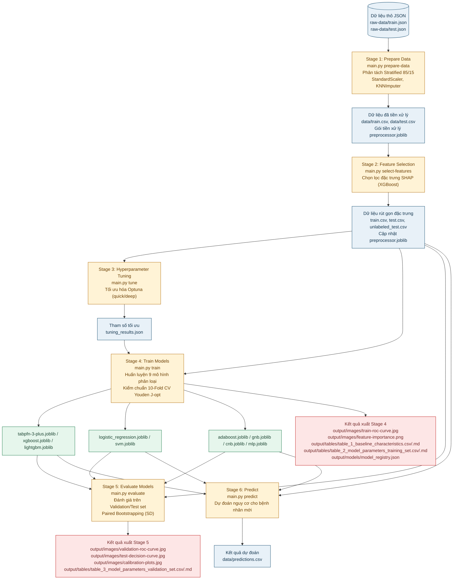

# DKA-AKI Machine Learning Pipeline

Hệ thống Học máy (Machine Learning) toàn diện nhằm dự đoán nguy cơ xảy ra **Tổn thương Thận cấp tính (Acute Kidney Injury - AKI)** ở bệnh nhân **Nhiễm toan Ceton Đái tháo đường (Diabetic Ketoacidosis - DKA)** trong vòng một tuần kể từ khi nhập viện Chăm sóc Tích cực (ICU). 

Dự án được xây dựng dựa trên cơ sở dữ liệu y tế quy mô lớn **MIMIC-IV**, phát triển và so sánh hiệu năng của 9 thuật toán học máy khác nhau nhằm tìm ra mô hình dự đoán tối ưu nhất.

---

## 📌 Tổng quan Quy trình xử lý (Pipeline Stages)

Dưới đây là sơ đồ kiến trúc tổng quan của toàn bộ hệ thống từ khâu nạp dữ liệu thô cho tới huấn luyện, đánh giá và xuất kết quả trực quan (bao gồm cả các bảng y khoa lâm sàng và đồ thị):



---

## 📂 Cấu trúc Thư mục Dự án

```text
├── src/
│   ├── __init__.py
│   ├── artifacts.py          # Quản lý lưu trữ/tải preprocessor bundle và model registry
│   ├── config.py             # Cấu hình môi trường, nạp .env và cấu hình đường dẫn
│   ├── data_loader.py        # Nạp dữ liệu JSON/CSV, làm phẳng cấu trúc, mã hóa phân loại lâm sàng
│   ├── preprocess.py         # Lọc bỏ cột khuyết > 20%, nội suy KNN, chuẩn hóa dữ liệu (không rò rỉ)
│   ├── feature_selection.py  # Thuật toán chọn lọc đặc trưng SHAP (XGBoost)
│   ├── models.py             # Định nghĩa cấu hình mặc định/tune cho 9 thuật toán học máy phân loại
│   ├── evaluate.py           # Tính toán độ đo lâm sàng (Youden J-optimal, Paired Bootstrapping)
│   ├── visualization.py      # Trực quan đồ thị y học (ROC, Calibration, DCA, SHAP Importance, Feature Importance)
│   ├── extract_tables.py     # Thống kê mô tả (Mann-Whitney U, Chi-square) và xuất các bảng y khoa
│   ├── pipeline_prepare.py   # Stage 1: Làm phẳng, phân tách stratified 85/15 và tiền xử lý dữ liệu
│   ├── pipeline_select_features.py # Stage 2: Điều phối thực thi và ghi đè dữ liệu chọn đặc trưng
│   ├── hyperparameter_tuning.py    # Stage 3: Tinh chỉnh siêu tham số các mô hình bằng Optuna
│   ├── pipeline_train.py     # Stage 4: Huấn luyện các mô hình, vẽ ROC train và xuất Bảng 1 & Bảng 2
│   ├── pipeline_evaluate.py  # Stage 5: Đánh giá mô hình trên tập test, vẽ đồ thị DCA/Calibration và xuất Bảng 3
│   └── pipeline_predict.py   # Stage 6: Dự báo nguy cơ AKI cho dữ liệu thô bệnh nhân mới dạng JSON
├── resource/                 # Thư mục tài nguyên dữ liệu của dự án
│   ├── data/                 # Thư mục lưu dữ liệu preprocessed (train.csv, test.csv)
│   ├── raw-data/             # Thư mục chứa dữ liệu đầu vào gốc (train.json, test.json)
│   └── tabpfn-pretrain/      # Thư mục chứa model checkpoint tiền huấn luyện của TabPFN-3
├── output/                   # Thư mục lưu trữ kết quả đầu ra
│   ├── predictions.csv       # Kết quả dự báo lâm sàng định dạng CSV
│   ├── images/               # Chứa 6 biểu đồ y khoa kết xuất từ pipeline
│   ├── tables/               # Chứa các bảng kết quả lâm sàng định dạng CSV và Markdown
│   └── models/               # Chứa các mô hình đã lưu (.joblib) và metadata registry
├── sample/                   # Chứa mẫu dữ liệu, biểu đồ và tài liệu nghiên cứu tham chiếu
│   ├── document/             # Tài liệu nghiên cứu gốc (PDF/Markdown)
│   ├── images/               # Biểu đồ mẫu chất lượng cao
│   └── tables/               # Bảng biểu mẫu kết quả thống kê
├── Dockerfile                # Dockerfile tối ưu đa giai đoạn (Multi-stage build) sử dụng `uv`
├── docker-compose.yml        # Docker Compose cấu hình chạy và mount thư mục kết quả đầu ra
├── main.py                   # Điểm khởi chạy (Entrypoint) điều phối toàn bộ CLI pipeline
├── pyproject.toml            # Định nghĩa các dependencies và môi trường chạy/dev
└── .env.example              # Mẫu tệp cấu hình biến môi trường
```

---

## 🛠️ Chi tiết các Bước thực hiện trong Mã nguồn

### 1. Làm sạch & Chuẩn bị dữ liệu (`src/pipeline_prepare.py`)
*   **Làm phẳng dữ liệu lồng nhau (Flattening)**: Tự động trích xuất các chỉ số sinh lý nằm sâu trong trường `measures` của tệp JSON gốc.
*   **Trích xuất giá trị thời gian sớm nhất**: Sắp xếp các mốc thời gian (timestamp) theo trình tự tuyến tính và chỉ lấy giá trị đo được đầu tiên tại thời điểm bệnh nhân nhập viện ICU.
*   **Mã hóa danh mục nghiêm ngặt (Strict Categorical Encoding)**: 
    *   Giới tính (`gender`): Chuyển `"M"` thành `1`, `"F"` thành `0`.
    *   Bệnh gan (`liver_disease`): Chuyển `"NONE"` -> `0`, `"MILD"` -> `1`, `"SEVERE"` -> `2`.
    *   Chủng tộc (`race`): Bản đồ hóa 26 chủng tộc khác nhau thành các nhãn số nguyên từ `0` đến `25`.
*   **Chống rò rỉ dữ liệu (No Data Leakage)**: Thực hiện phân chia độc lập tập Train/Test theo tỷ lệ Stratified 85/15. Bộ lọc cột khuyết thiếu (>20%), bộ nội suy KNN (`KNNImputer(n_neighbors=5)`) và bộ chuẩn hóa `StandardScaler` đều được fit trên tập Train, sau đó áp dụng (transform) sang tập Test. Tránh rò rỉ thông tin tối đa.
*   **Lưu gói tiền xử lý**: Toàn bộ tham số tiền xử lý được đóng gói và lưu tại `output/models/preprocessor.joblib`.

### 2. Chọn lọc đặc trưng bằng SHAP kết hợp XGBoost (`src/pipeline_select_features.py`)
*   **Huấn luyện mô hình XGBoost làm mẫu**: Sử dụng mô hình `XGBClassifier` được tối ưu hóa cơ bản trên tập Train.
*   **Tính toán trị số SHAP**: Sử dụng `shap.TreeExplainer` để tính giá trị SHAP trung bình tuyệt đối cho từng đặc trưng, phản ánh mức đóng góp trung bình của biến vào dự đoán nguy cơ AKI.
*   **Lựa chọn đặc trưng cố định (Top 20)**: Sắp xếp theo mức độ ảnh hưởng giảm dần và chọn ra đúng 20 đặc trưng hàng đầu có điểm SHAP cao nhất để làm đầu vào cho các bước tiếp theo, tránh mất ổn định so với việc đặt ngưỡng điểm số.
*   **Đồng bộ dữ liệu đặc trưng**: Ghi đè trực tiếp 20 cột được chọn vào `train.csv`, `test.csv` và `unlabeled_test.csv` trên đĩa. Vẽ biểu đồ tầm quan trọng đặc trưng dựa trên SHAP vào `output/images/shap-feature-importance.png` và xuất bảng chi tiết với cột `SHAP Importance` tương ứng vào `output/tables/feature_selection_results.csv/.md`.

### 3. Tinh chỉnh siêu tham số bằng Optuna (`src/hyperparameter_tuning.py`)
*   Sử dụng framework Optuna để tối ưu hóa siêu tham số cho từng thuật toán trong số 9 mô hình. Kết quả tham số tốt nhất sẽ được lưu trữ tự động trong `output/models/tuning_results.json`.
*   **Chiến lược `deep` ưu tiên XGBoost**: Budget `deep` hiện tập trung mạnh vào XGBoost với `200` trial, đồng thời giảm trial của các mô hình còn lại để tiết kiệm thời gian tuning tổng thể.
*   **Không gian tìm kiếm XGBoost mở rộng**: Ngoài các tham số chính như `n_estimators`, `max_depth`, `learning_rate`, `subsample`, `colsample_bytree` và `scale_pos_weight`, pipeline còn tune thêm `reg_alpha`, `reg_lambda`, `min_child_weight` và `gamma` để kiểm soát regularization, độ phức tạp cây và điều kiện split.

### 4. Huấn luyện các mô hình (`src/pipeline_train.py`)
*   **Huấn luyện 9 mô hình**: Nạp siêu tham số tối ưu từ `tuning_results.json` (nếu có) để huấn luyện 9 mô hình phân loại:
    1.  **TabPFN-3-Plus Classifier** (Mô hình nền tảng phân loại bảng đề xuất)
    2.  **XGBoost Classifier**
    3.  **Logistic Regression**
    4.  **LightGBM Classifier**
    5.  **AdaBoost Classifier**
    6.  **Gaussian Naive Bayes (GNB)**
    7.  **Complement Naive Bayes (CNB)**
    8.  **MLP Classifier (Multi-layer Perceptron)**
    9.  **Support Vector Machine (SVM)**
*   **Kiểm chuẩn chéo 10-Fold Stratified CV**: Đánh giá độ ổn định của các thuật toán trên tập Train.
*   **Ngưỡng tối ưu Youden J**: Các chỉ số phân loại lâm sàng được đánh giá tại ngưỡng cắt tối ưu hóa chỉ số Youden J (tối đa hóa Sensitivity + Specificity).
*   **Xuất kết quả**: Lưu mô hình vào `output/models/`, ghi nhận metadata vào `model_registry.json`, vẽ biểu đồ so sánh ROC 10-Fold CV (`output/images/train-roc-curve.jpg`), vẽ feature importance của XGBoost (`output/images/xgb-feature-importance.png`), tính toán hoán vị đặc trưng cho TabPFN (`output/images/tabpfn-feature-importance.png`), đồng thời xuất **Bảng 1 (Baseline Characteristics)** và **Bảng 2 (Model parameters in training set)** vào `output/tables/`.

### 5. Đánh giá mô hình trên tập kiểm thử (`src/pipeline_evaluate.py`)
*   **Đánh giá tổng quát**: Đọc mô hình tốt nhất từ registry (hoặc mô hình do người dùng chỉ định), đánh giá hiệu năng trên tập test/validation độc lập.
*   **Paired Bootstrapping**: Thực hiện lấy mẫu bootstrap phân tầng (100 lượt) để tính toán độ lệch chuẩn (SD) cho các độ đo của toàn bộ 9 mô hình. Sử dụng giá trị ước lượng điểm (Point Estimate) trên tập validation gốc làm hiệu năng chính để đảm bảo tính nhất quán giữa biểu đồ ROC và bảng kết quả.
*   **Xuất đồ thị và bảng**: Vẽ biểu đồ ROC tập test (`output/images/validation-roc-curve.jpg`), biểu đồ đường cong quyết định DCA (`output/images/test-decision-curve.jpg`) và biểu đồ Calibration (`output/images/calibration-plots.jpg`) cho mô hình được chọn đánh giá (mặc định là mô hình tối ưu nhất TabPFN-3-Plus), và xuất **Bảng 3 (Model parameters in validation set)** vào `output/tables/`.

### 6. Dự đoán nguy cơ y khoa (`src/pipeline_predict.py`)
*   Nhận tệp đầu vào bệnh nhân mới định dạng JSON thô, áp dụng gói tiền xử lý và mô hình tốt nhất đã huấn luyện để dự báo xác suất và nhãn phân loại (0/1). Kết quả được xuất ra tệp CSV (`output/predictions.csv`).

---

## 🚀 Hướng dẫn Cài đặt & Sử dụng

### 1. Chuẩn bị Môi trường

Yêu cầu Python từ phiên bản **3.11** trở lên. Dự án được tối ưu hóa tốt nhất thông qua công cụ quản lý package `uv` của Astral.

#### Phụ thuộc hệ thống (Linux)
Một số mô hình như LightGBM/XGBoost cần thư viện OpenMP. Hãy đảm bảo cài đặt `libgomp1` trên máy trước:
```bash
sudo apt update
sudo apt install -y libgomp1
```

#### Cách 1: Sử dụng công cụ `uv` (Cực nhanh và khuyên dùng)
```bash
# Cài đặt uv nếu hệ thống chưa có
curl -LsSf https://astral.sh/uv/install.sh | sh

# Khởi tạo môi trường ảo và cài đặt dependencies
uv venv
source .venv/bin/activate
uv pip install -e .
```

#### Cách 2: Sử dụng `pip` truyền thống
```bash
python3 -m venv .venv
source .venv/bin/activate
pip install --upgrade pip
pip install -e .
```

### 2. Thiết lập Biến môi trường

Sao chép tệp `.env.example` thành `.env` để cấu hình đường dẫn cho pipeline:
```bash
cp .env.example .env
```
Mặc định trong `.env` đã cấu hình các đường dẫn tối ưu cho dự án:
```env
RAW_TRAIN_DATA_PATH=resource/raw-data/train.json
RAW_TEST_DATA_PATH=resource/raw-data/test.json
TRAIN_DATA_PATH=resource/data/train.csv
TEST_DATA_PATH=resource/data/test.csv
PREDICTIONS_OUTPUT_PATH=output/predictions.csv
IMAGES_DIR=output/images
TABLES_DIR=output/tables
MODELS_DIR=output/models
```

### 3. Thực thi các giai đoạn Pipeline

Chạy tuần tự các lệnh sau thông qua CLI điều phối của `main.py`:

#### Bước 1: Làm sạch & Chuẩn bị dữ liệu (Prepare Data)
Đọc dữ liệu JSON thô, tách tập Train/Test theo tỷ lệ stratified 85/15, tiền xử lý và lưu bundle preprocessor:
```bash
uv run main.py prepare-data
```

#### Bước 2: Chọn lọc đặc trưng (Feature Selection)
Thực hiện lọc đặc trưng bằng SHAP kết hợp XGBoost, cập nhật `preprocessor.joblib`, ghi đè các cột dữ liệu rút gọn vào tệp CSV và xuất biểu đồ SHAP feature importance:
```bash
uv run main.py select-features
```

#### Bước 3: Tinh chỉnh siêu tham số (Hyperparameter Tuning - Không bắt buộc)
Thực hiện tìm kiếm tham số tối ưu bằng Optuna trên đặc trưng rút gọn:
```bash
uv run main.py tune --budget deep
```
Budget `deep` là cấu hình khuyến nghị khi muốn tuning XGBoost mạnh hơn: XGBoost chạy `200` trial; LightGBM chạy `20` trial; SVM, Logistic Regression, AdaBoost và MLP chạy `5` trial mỗi mô hình; GNB và CNB chạy `2` trial; TabPFN-3-Plus không tune (`0` trial).

Nếu cần chạy nhanh để kiểm thử workflow, dùng:
```bash
uv run main.py tune --budget quick
```

Có thể ghi đè số trial từng mô hình bằng các cờ CLI như `--trials-xgboost`, `--trials-lightgbm`, `--trials-svm`, `--trials-logistic`, `--trials-adaboost`, `--trials-gnb`, `--trials-cnb` và `--trials-mlp`.

#### Bước 4: Huấn luyện mô hình (Train Models)
Huấn luyện 9 mô hình phân loại trên tập Train, áp dụng kiểm chuẩn chéo 10-Fold CV Youden J-optimal, lưu file mô hình `.joblib` và registry, vẽ biểu đồ ROC train & feature importance, xuất Bảng 1 & Bảng 2:
```bash
uv run main.py train
```

#### Bước 5: Đánh giá mô hình (Evaluate Models)
Đánh giá hiệu năng của các mô hình trên tập kiểm thử/validation độc lập, tính toán SD bằng Paired Bootstrapping, vẽ biểu đồ ROC test, DCA, Calibration và xuất Bảng 3:
```bash
uv run main.py evaluate
```

#### Bước 6: Dự đoán nguy cơ AKI (Predict)
Dự đoán nguy cơ y khoa cho tập bệnh nhân mới (đầu vào bắt buộc là tệp JSON thô, đầu ra xuất kết quả dạng CSV):
```bash
uv run main.py predict --input-path resource/raw-data/test.json --output-path output/predictions.csv
```

---

## 🐳 Sử dụng với Docker & Docker Compose

Dự án được cấu hình Dockerfile đa giai đoạn (Multi-stage build) kết hợp cùng `uv` để thu nhỏ dung lượng Image xuống mức tối đa.

### Cách 1: Sử dụng Docker Compose (Khuyên dùng)
Chạy lệnh duy nhất để build Image và thực thi toàn bộ pipeline, kết quả đầu ra sẽ được mount trực tiếp ra thư mục `output/` ở máy host:
```bash
docker compose up --build
```

### Cách 2: Chạy Docker độc lập (Từng bước hoặc Toàn bộ)
1.  **Build Docker Image**:
    ```bash
    docker build -t dka-aki-pipeline:latest .
    ```
2.  **Khởi chạy Container**:
    Mount các thư mục từ máy host vào container để nhận dữ liệu đầu vào và lưu trữ kết quả đầu ra. 

    *   **Chạy toàn bộ các bước của pipeline:**
        ```bash
        docker run --rm \
          -v "$(pwd)/resource:/app/resource" \
          -v "$(pwd)/output:/app/output" \
          dka-aki-pipeline:latest sh -c "python main.py prepare-data && python main.py select-features && python main.py train && python main.py evaluate && python main.py predict"
        ```
    *   **Hoặc chạy một bước cụ thể** (Thay `train` bằng bước mong muốn như `prepare-data`, `select-features`, `evaluate`, `predict` hoặc `tune`):
        ```bash
        docker run --rm \
          -v "$(pwd)/resource:/app/resource" \
          -v "$(pwd)/output:/app/output" \
          dka-aki-pipeline:latest python main.py train
        ```

---

## 📈 Kết quả đầu ra dự kiến trong thư mục `output/`

Sau khi pipeline được thực thi đầy đủ, thư mục `output/` sẽ chứa các kết quả sau:

### 1. Thư mục `output/images/` (Các biểu đồ trực quan hóa)
-   `train-roc-curve.jpg`: Biểu đồ ROC 10-Fold CV của 9 mô hình trên tập Train.
-   `validation-roc-curve.jpg`: Biểu đồ ROC so sánh hiệu năng các mô hình trên tập Test.
-   `shap-feature-importance.png`: Biểu đồ biểu diễn mức độ quan trọng của đặc trưng y học dựa trên giá trị trung bình SHAP (Mean Absolute SHAP Value).
-   `xgb-feature-importance.png`: Đồ thị biểu diễn mức độ quan trọng đặc trưng lâm sàng của mô hình XGBoost.
-   `tabpfn-feature-importance.png`: Đồ thị biểu diễn mức độ quan trọng đặc trưng của mô hình TabPFN-3-Plus bằng Permutation Importance.
-   `test-decision-curve.jpg`: Biểu đồ đường cong quyết định (Decision Curve Analysis - DCA) của mô hình được đánh giá (mặc định là TabPFN-3-Plus).
-   `calibration-plots.jpg`: Biểu đồ Calibration biểu thị mức độ tin cậy (reliability) của mô hình được đánh giá (mặc định là TabPFN-3-Plus).

### 2. Thư mục `output/tables/` (Bảng thống kê y khoa lâm sàng)
-   `table_1_baseline_characteristics.csv` & `.md`: Bảng 1 thống kê mô tả đặc trưng nền của nhóm bệnh nhân (so sánh giữa nhóm AKI và Non-AKI).
-   `table_2_model_parameters_training_set.csv` & `.md`: Bảng 2 hiển thị các độ đo chi tiết của 9 mô hình trong huấn luyện chéo 10-Fold CV tại ngưỡng tối ưu.
-   `table_3_model_parameters_validation_set.csv` & `.md`: Bảng 3 hiển thị hiệu năng ước lượng điểm kèm độ lệch chuẩn (Paired Bootstrap) của 9 mô hình trên tập test.
-   `feature_selection_results.csv` & `.md`: Bảng chi tiết kết quả chọn lọc đặc trưng với cột `SHAP Importance` tương ứng.
