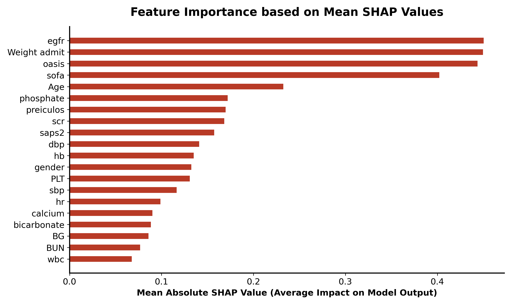
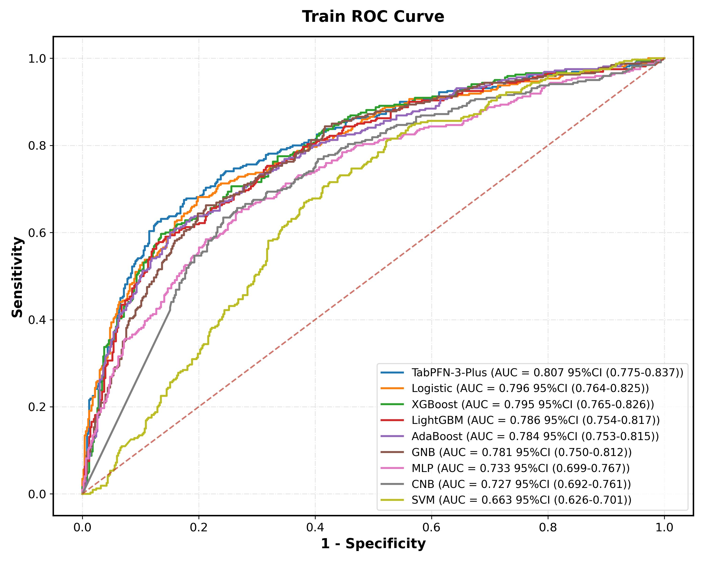
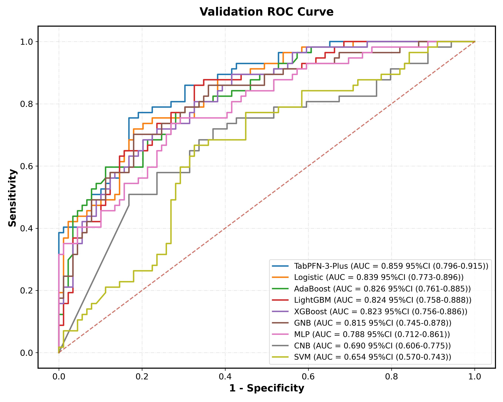
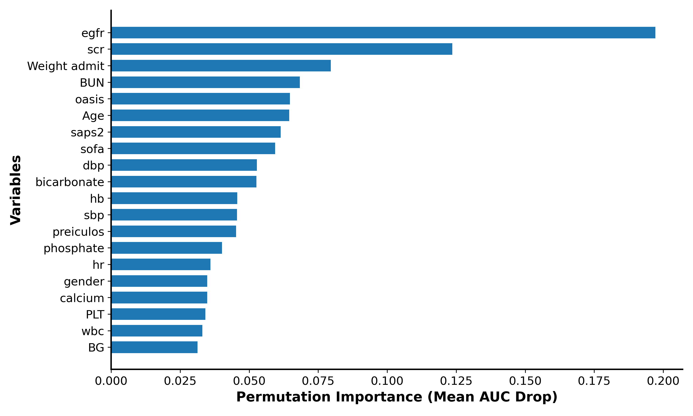
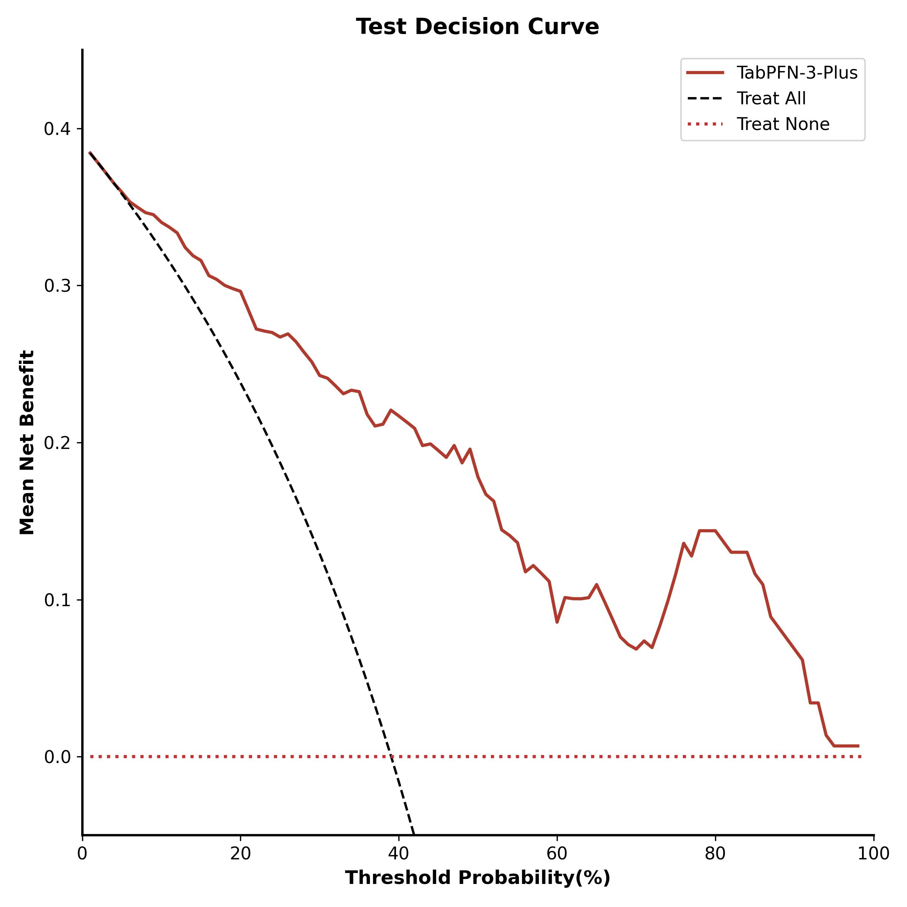
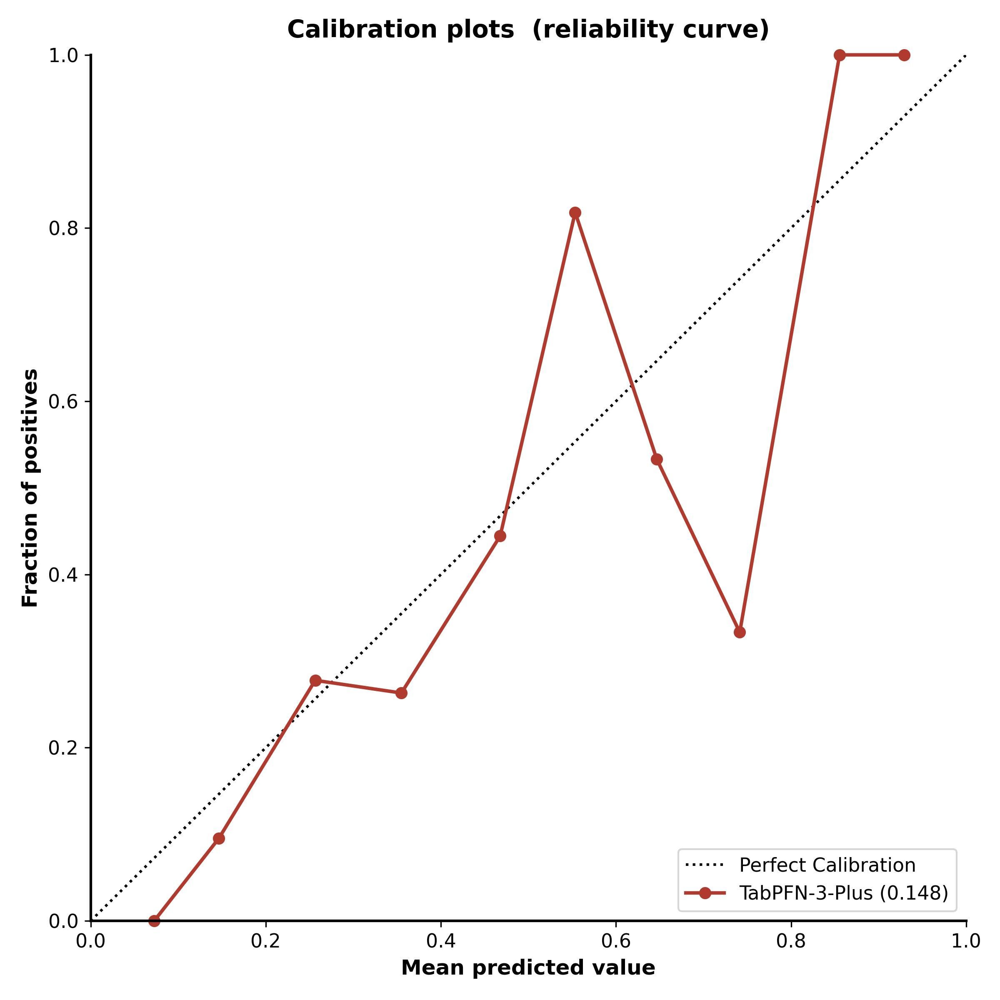

::: {.markdown-only}

# Mục lục
- [Tóm tắt](#tóm-tắt)
- [Các đóng góp chính của báo cáo](#các-đóng-góp-chính-của-báo-cáo)
- [Từ khóa](#từ-khóa)
- [1. Giới thiệu](#1-giới-thiệu)
- [2. Các nghiên cứu liên quan](#2-các-nghiên-cứu-liên-quan)
  - [2.1. Các mô hình lâm sàng và phương pháp thống kê truyền thống trong chẩn đoán và dự đoán tổn thương thận cấp tính ở bệnh nhân nhiễm toan keton do tiểu đường](#21-các-mô-hình-lâm-sàng-và-phương-pháp-thống-kê-truyền-thống-trong-chẩn-đoán-và-dự-đoán-tổn-thương-thận-cấp-tính-ở-bệnh-nhân-nhiễm-toan-keton-do-tiểu-đường)
  - [2.2. Sự trỗi dậy của Học máy trong dự đoán tổn thương thận cấp tính tại các lĩnh vực chăm sóc đặc biệt](#22-sự-trỗi-dậy-của-học-máy-trong-dự-đoán-tổn-thương-thận-cấp-tính-tại-các-lĩnh-vực-chăm-sóc-đặc-biệt)
  - [2.3. Khám phá cơ chế sinh lý bệnh và các yếu tố lâm sàng quan trọng gây AKI: Nền tảng cho việc lựa chọn đặc trưng](#23-khám-phá-cơ-chế-sinh-lý-bệnh-và-các-yếu-tố-lâm-sàng-quan-trọng-gây-aki-nền-tảng-cho-việc-lựa-chọn-đặc-trưng)
  - [2.4. Phân tích các vấn đề đang gặp phải của bài toán và đề xuất giải pháp đột phá](#24-phân-tích-các-vấn-đề-đang-gặp-phải-của-bài-toán-và-đề-xuất-giải-pháp-đột-phá)
- [3. Mô hình đề xuất](#3-mô-hình-đề-xuất)
  - [3.1. Tập dữ liệu](#31-tập-dữ-liệu)
  - [3.2. Kiến trúc của mô hình đề xuất](#32-kiến-trúc-của-mô-hình-đề-xuất)
  - [3.3. Các độ đo đánh giá](#33-các-độ-do-đánh-giá)
- [4. Thử nghiệm và đánh giá](#4-thử-nghiệm-và-đánh-giá)
  - [4.1. Thử nghiệm](#41-thử-nghiệm)
  - [4.2. Đánh giá](#42-đánh-giá)
  - [4.3. Các đóng góp chính của bài báo](#43-các-đóng-góp-chính-của-bài-báo)
- [5. Kết luận](#5-kết-luận)
- [Tài liệu tham khảo](#tài-liệu-tham-khảo)

# Danh mục bảng biểu
- [Bảng 1. Đặc điểm lâm sàng nền của hai nhóm bệnh nhân](#bang-1)
- [Bảng 2. Tỷ lệ dữ liệu khuyết thiếu và phương án xử lý](#bang-2)
- [Bảng 3. Hiệu năng các mô hình trên tập huấn luyện](#bang-3)
- [Bảng 4. Hiệu năng các mô hình trên tập kiểm thử độc lập](#bang-4)

# Danh mục hình vẽ
- [Hình 1. Sơ đồ quy trình dự đoán DKA-AKI](#hinh-1)
- [Hình 2. Quy trình lựa chọn đặc trưng bằng SHAP và XGBoost](#hinh-2)
- [Hình 3. Độ quan trọng đặc trưng theo giá trị SHAP](#hinh-3)
- [Hình 4. Kiến trúc mô hình TabPFN-3-Plus](#hinh-4)
- [Hình 5. Đường cong ROC trên tập huấn luyện](#hinh-5)
- [Hình 6. Đường cong ROC trên tập kiểm thử](#hinh-6)
- [Hình 7. Độ quan trọng đặc trưng của mô hình TabPFN-3-Plus](#hinh-7)
- [Hình 8. Đường cong phân tích quyết định (DCA)](#hinh-8)
- [Hình 9. Biểu đồ hiệu chuẩn](#hinh-9)

:::
```{=openxml}
<w:p>
  <w:pPr>
    <w:pStyle w:val="TOCHeading"/>
  </w:pPr>
  <w:r>
    <w:t>Mục lục</w:t>
  </w:r>
</w:p>
<w:p>
  <w:pPr>
    <w:pStyle w:val="TableofFigures"/>
  </w:pPr>
  <w:r>
    <w:fldSimple w:instr="TOC \o &quot;1-3&quot; \h \z \u"/>
  </w:r>
</w:p>
<w:p>
  <w:pPr>
    <w:pStyle w:val="TOCHeading"/>
  </w:pPr>
  <w:r>
    <w:t>Danh mục bảng biểu</w:t>
  </w:r>
</w:p>
<w:p>
  <w:pPr>
    <w:pStyle w:val="TableofFigures"/>
  </w:pPr>
  <w:r>
    <w:fldSimple w:instr="TOC \h \z \c &quot;Bảng&quot;"/>
  </w:r>
</w:p>
<w:p>
  <w:pPr>
    <w:pStyle w:val="TOCHeading"/>
  </w:pPr>
  <w:r>
    <w:t>Danh mục hình vẽ</w:t>
  </w:r>
</w:p>
<w:p>
  <w:pPr>
    <w:pStyle w:val="TableofFigures"/>
  </w:pPr>
  <w:r>
    <w:fldSimple w:instr="TOC \h \z \c &quot;Hình&quot;"/>
  </w:r>
</w:p>
```


# Tóm tắt

Nhiễm toan ceton do đái tháo đường, thường gọi là DKA, là một biến chứng cấp tính và nghiêm trọng ở bệnh nhân tiểu đường, với khoảng 40–50% trường hợp tiến triển thành tổn thương thận cấp tính AKI. Nghiên cứu này phát triển một mô hình học máy để dự báo sớm nguy cơ AKI trong vòng một tuần ở bệnh nhân DKA nhập viện điều trị tích cực tại ICU dựa trên cơ sở dữ liệu y tế MIMIC-IV. Với cỡ mẫu thực tế gồm 970 bệnh nhân có nhãn lâm sàng đầy đủ, các đặc trưng có tỷ lệ thiếu trên 20% bị loại bỏ, và dữ liệu khuyết dưới mức này được xử lý nội suy bằng thuật toán lân cận gần nhất KNN. Dữ liệu được phân chia theo phương pháp phân tầng ngẫu nhiên với tỷ lệ 85/15 thành tập huấn luyện gồm 824 mẫu và tập kiểm thử độc lập sạch hoàn toàn gồm 146 mẫu. Phương pháp chọn lọc đặc trưng bằng trị số SHAP từ mô hình XGBoost cơ bản được áp dụng để chọn ra 20 đặc trưng tối ưu nhất trước khi huấn luyện 9 thuật toán học máy khác nhau. Kết quả thực nghiệm cho thấy mô hình nền tảng dữ liệu bảng TabPFN-3-Plus đạt hiệu suất cao nhất với chỉ số diện tích dưới đường cong AUC là 0,859 trên tập kiểm thử độc lập, theo sau bởi mô hình hồi quy Logistic đạt AUC là 0,839 và mô hình AdaBoost đạt AUC là 0,826. Phân tích độ đóng góp đặc trưng của mô hình TabPFN-3-Plus bằng phương pháp hoán vị đặc trưng chỉ ra rằng các yếu tố sinh lý cốt lõi cảnh báo sớm nguy cơ DKA-AKI hàng đầu bao gồm mức lọc cầu thận ước tính eGFR, nồng độ creatinine huyết thanh SCr, cân nặng, nồng độ urê máu BUN và điểm OASIS. Công trình thực nghiệm này cung cấp một mô hình dự báo sạch, tin cậy và chính xác về mặt lâm sàng, giúp nhận diện sớm nhóm bệnh nhân nguy cơ cao tại ICU để đưa ra can thiệp kịp thời.


# Các đóng góp chính của báo cáo

Bài báo tiên phong trong việc phát triển mô hình học máy ứng dụng thuật toán nền tảng dữ liệu bảng TabPFN-3 để dự đoán nguy cơ tổn thương thận cấp tính liên quan đến nhiễm toan ceton do đái tháo đường DKA-AKI ở bệnh nhân hồi sức tích cực ICU. Trước đây chưa có nghiên cứu nào ứng dụng các mô hình nền tảng, đặc biệt là TabPFN-3, để xây dựng mô hình dự đoán theo thời gian thực cho mục đích này.

Đóng góp thứ hai nằm ở việc sử dụng cơ sở dữ liệu lớn kết hợp thiết kế mô hình đánh giá đa dạng thuật toán. Nghiên cứu đã tận dụng tập dữ liệu thế giới thực lớn mạnh MIMIC-IV, đạt được cỡ mẫu bệnh nhân DKA lớn nhất so với các nghiên cứu tương tự. Các tác giả đã lựa chọn và so sánh hiệu suất của 9 thuật toán học máy khác nhau bao gồm TabPFN-3-Plus, hồi quy logistic, XGBoost, LightGBM, AdaBoost, Gaussian Naïve Bayes GNB, Complement Naive Bayes CNB, mạng nơ-ron đa lớp MLP và máy vectơ hỗ trợ SVM, kết hợp với kỹ thuật chọn lọc đặc trưng SHAP để tìm ra mô hình dự đoán tối ưu nhất.

Cuối cùng, nghiên cứu đã xác định và định lượng mức độ quan trọng của các yếu tố nguy cơ của mô hình TabPFN-3-Plus thông qua phương pháp hoán vị đặc trưng. Chúng tôi đã chỉ ra cụ thể các đặc trưng sinh lý lâm sàng quan trọng nhất đối với DKA-AKI sau chọn lọc đặc trưng SHAP. Trong đó, mức lọc cầu thận ước tính eGFR và creatinine huyết thanh SCr có vai trò chỉ báo đặc biệt quan trọng. Đồng thời, mô hình đã nhận diện được các yếu tố nguy cơ hàng đầu khác là cân nặng, nồng độ urê máu BUN và điểm đánh giá mức độ nặng OASIS. Việc xếp hạng độ quan trọng này không chỉ cung cấp bằng chứng định lượng rõ ràng mà còn biến mô hình học máy thành một công cụ hỗ trợ quyết định lâm sàng có tính ứng dụng cao, giúp các bác sĩ nhận diện sớm nhóm bệnh nhân nguy cơ cao tại ICU ngay cả khi thiếu hụt các chỉ số giám sát động học như thể tích nước tiểu hay thể tích dịch truyền.


# Từ khóa

diabetic ketosis; acute kidney injury; machine learning; TabPFN-3; outcome


# 1. Giới thiệu

Nhiễm toan ceton do đái tháo đường DKA là một trong những biến chứng cấp tính nguy hiểm nhất và có khả năng đe dọa tính mạng người bệnh nếu không được can thiệp y tế kịp thời. Tình trạng bệnh lý này đặc trưng bởi ba yếu tố chính: sự mất kiểm soát nghiêm trọng nồng độ glucose trong máu, tình trạng nhiễm toan chuyển hóa và sự gia tăng các thể ceton trong cơ thể. Những rối loạn chuyển hóa sâu sắc này không chỉ gây ra các triệu chứng tức thời mà còn dẫn đến sự mất cân bằng nghiêm trọng về điện giải và chất lỏng, từ đó mở đường cho một loạt các biến chứng thứ phát nguy hiểm, bao gồm phù não, tổn thương thận cấp tính AKI và trong những trường hợp cực kỳ nghiêm trọng, có thể dẫn đến suy thận hoàn toàn [1, 2]. Trong số các biến chứng này, tổn thương thận cấp tính AKI nổi lên như một vấn đề phổ biến và đáng lo ngại, ảnh hưởng đến khoảng 40% đến 50% tổng số bệnh nhân mắc DKA. Sự xuất hiện của AKI ở bệnh nhân DKA không chỉ đơn thuần là một dấu hiệu lâm sàng mà còn là một yếu tố làm trầm trọng thêm tiên lượng bệnh, dẫn đến tỷ lệ mắc bệnh tật và tử vong tăng cao, thời gian nằm lại khoa hồi sức tích cực ICU kéo dài, tăng nguy cơ tiến triển thành bệnh thận mạn tính CKD trong tương lai, cũng như gia tăng khả năng tái phát các đợt AKI trong suốt quá trình điều trị tại ICU [3, 4]. Do những hệ lụy nghiêm trọng này, việc theo dõi sát sao bệnh nhân DKA để phát hiện sớm các dấu hiệu của AKI và can thiệp kịp thời là vô cùng cấp thiết nhằm giảm thiểu tối đa các tác động tiêu cực có thể xảy ra.

Trong thực hành lâm sàng hiện nay, việc chẩn đoán AKI chủ yếu dựa trên sự biến đổi động học của nồng độ creatinine huyết thanh SCr và lượng nước tiểu, tuân theo các khuyến nghị thực hành lâm sàng được thiết lập bởi tổ chức Cải thiện Kết quả Toàn cầu về Bệnh Thận KDIGO [5]. Mặc dù đây là tiêu chuẩn vàng hiện tại, nhưng nó tồn tại một hạn chế đáng kể: tổn thương thực thể tại thận thường xảy ra rất lâu trước khi nồng độ SCr tăng lên đủ để được phát hiện qua các xét nghiệm thông thường. Điều này có nghĩa là, vào thời điểm AKI chính thức được chẩn đoán dựa trên sự thay đổi của SCr, thận đã phải chịu đựng một mức độ tổn thương nhất định [6]. Tổn thương thận cấp tính liên quan đến DKA DKA-AKI thường phát sinh do tình trạng giảm tưới máu thận, hậu quả của việc giảm thể tích tuần hoàn. Tuy nhiên, chức năng thận hoàn toàn có thể được cải thiện đến một mức độ nhất định nếu có các biện pháp phòng ngừa và điều trị hiệu quả, chẳng hạn như sử dụng thuốc vận mạch hợp lý, đảm bảo tưới máu thận đầy đủ và quan trọng nhất là tránh sử dụng các loại thuốc có độc tính với thận [7]. Do đó, nhu cầu cấp bách đặt ra là phải khám phá và xác định các yếu tố dự báo đáng tin cậy cho AKI, từ đó thiết lập các chiến lược giám sát chặt chẽ đối với nhóm bệnh nhân có nguy cơ cao mắc DKA-AKI. Nếu có thể xác định sớm những bệnh nhân này, các bác sĩ lâm sàng sẽ có cơ hội can thiệp kịp thời bằng các biện pháp quản lý phù hợp, từ đó cải thiện đáng kể tiên lượng cho bệnh nhân DKA.

Để giải quyết bài toán dự đoán rủi ro DKA-AKI, nhiều nghiên cứu trước đây đã nỗ lực tìm kiếm và xác định các yếu tố nguy cơ. Một số nghiên cứu đã chỉ ra rằng các yếu tố lâm sàng và cận lâm sàng đa dạng như tuổi tác, loại đái tháo đường, các bệnh lý đồng mắc, nhịp thở RR, huyết áp, nồng độ SCr cơ bản, nitơ urê máu BUN và lượng nước tiểu có thể được sử dụng làm các chỉ số để dự đoán nguy cơ phát triển DKA-AKI [3, 4, 8]. Trong một nghiên cứu trước đó của nhóm tác giả, một mô hình dự đoán rủi ro DKA-AKI dựa trên phương pháp hồi quy logistic truyền thống đã được phát triển và một biểu đồ toán đồ nomogram đã được xây dựng để hỗ trợ trực quan hóa kết quả dự đoán [9]. Hơn nữa, trên phạm vi rộng hơn của việc dự đoán AKI nói chung, nhiều mô hình dự báo khác nhau cũng đã được cộng đồng nghiên cứu đề xuất và phát triển [10–13]. Mặc dù đã có những tiến bộ nhất định, nhưng một khoảng trống lớn vẫn tồn tại trong tài liệu y khoa hiện hành: có rất ít các ấn phẩm nghiên cứu tập trung chuyên sâu vào việc xác định một cách đặc hiệu các rủi ro dẫn đến AKI riêng biệt ở quần thể bệnh nhân DKA, thay vì đánh giá AKI nói chung.

Trong những năm gần đây, sự bùng nổ của trí tuệ nhân tạo, đặc biệt là các thuật toán học máy, đã mang lại những công cụ mạnh mẽ với khả năng dự đoán vượt trội [14]. Khác với các phương pháp thống kê truyền thống, ML có khả năng xử lý lượng dữ liệu khổng lồ, đa chiều và tự động tìm ra các mối tương quan phức tạp, phi tuyến tính giữa các biến số mà con người khó có thể nhận biết. Trong bối cảnh quản lý bệnh nhân tại ICU, ML đã chứng minh được hiệu suất xuất sắc của mình. Khi được tích hợp với các hệ thống hồ sơ sức khỏe điện tử EHR, học máy có thể nâng cao đáng kể độ tin cậy và tính kịp thời của các hỗ trợ công nghệ dành cho chăm sóc đặc biệt [15]. Tuy nhiên, bất chấp những tiềm năng to lớn đó, cho đến nay, chưa có nghiên cứu nào ứng dụng các thuật toán ML tiên tiến để xây dựng một mô hình dự đoán và nhận diện các yếu tố rủi ro chuyên biệt cho tình trạng DKA-AKI.

Nhận thức được những hạn chế của các nghiên cứu hiện tại và tiềm năng chưa được khai thác của Học Máy, bài báo này đề xuất một giải pháp đột phá. Kế thừa hướng nghiên cứu ứng dụng học máy của Fan và cộng sự [34], mục tiêu chính của nghiên cứu này là phát triển một mô hình dự đoán sự xuất hiện của DKA-AKI theo thời gian thực bằng cách áp dụng một loạt các thuật toán ML tiên tiến, đồng thời tiến hành xác thực toàn diện hiệu suất của mô hình này. Cụ thể, nghiên cứu tận dụng cơ sở dữ liệu y tế quy mô lớn MIMIC-IV, trích xuất dữ liệu đa dạng bao gồm nhân khẩu học, dấu hiệu sinh tồn, đặc điểm lâm sàng, kết quả xét nghiệm và các biện pháp điều trị của bệnh nhân. Thông qua việc so sánh 9 thuật toán học máy khác nhau , bao gồm mô hình nền tảng dữ liệu bảng TabPFN-3-Plus, hồi quy logistic, XGBoost, LightGBM, AdaBoost, Gaussian Naïve Bayes GNB, mạng nơ-ron đa lớp MLP, Complement Naive Bayes CNB và máy vectơ hỗ trợ SVM,, nghiên cứu sẽ xác định mô hình tối ưu nhất. Việc áp dụng TabPFN-3 để tạo ra một công cụ dự đoán cá nhân hóa và mạnh mẽ được kỳ vọng sẽ là một bước tiến quan trọng trong việc nhận diện sớm và quản lý hiệu quả DKA-AKI. Mô hình này không chỉ giúp các bác sĩ lâm sàng can thiệp sớm, ngăn chặn các biến chứng nghiêm trọng hơn mà còn góp phần cải thiện tiên lượng tổng thể và tối ưu hóa việc phân bổ nguồn lực y tế cho nhóm bệnh nhân này.


# 2. Các nghiên cứu liên quan


## 2.1. Các mô hình lâm sàng và phương pháp thống kê truyền thống trong chẩn đoán và dự đoán tổn thương thận cấp tính ở bệnh nhân nhiễm toan keton do tiểu đường

Nhiễm toan keton do tiểu đường DKA là một biến chứng cấp tính nghiêm trọng của bệnh đái tháo đường, có thể dẫn đến tử vong nếu không được điều trị kịp thời [1, 2]. Bệnh lý này được đặc trưng bởi nồng độ glucose trong máu BG không được kiểm soát, tình trạng nhiễm toan và nhiễm keton máu [1, 2]. DKA có thể gây ra sự mất cân bằng nghiêm trọng về chất điện giải và dịch, dẫn đến các biến chứng nguy hiểm như phù não, tổn thương thận cấp tính AKI và thậm chí là suy thận trong những trường hợp nghiêm trọng [1, 2]. Trong đó, AKI là một biến chứng vô cùng phổ biến, ảnh hưởng đến khoảng 40 đến 50 phần trăm bệnh nhân mắc DKA [3, 4]. Đáng chú ý, sự xuất hiện của AKI có thể dẫn đến sự gia tăng tỷ lệ mắc bệnh và tỷ lệ tử vong, kéo dài thời gian nằm tại khoa hồi sức tích cực ICU, làm tăng tính nhạy cảm với bệnh thận mạn tính CKD và gây ra các đợt AKI tái phát trong quá trình điều trị tại ICU [3, 4]. Do đó, trong nhiều thập kỷ qua, việc theo dõi chặt chẽ bệnh nhân DKA để phát hiện các dấu hiệu của AKI và can thiệp kịp thời nhằm giảm thiểu tác động tiêu cực tiềm ẩn của nó luôn là ưu tiên hàng đầu của các bác sĩ lâm sàng [3, 4].

Các phương pháp chẩn đoán lâm sàng truyền thống đối với AKI thường dựa trên sự thay đổi động của creatinine huyết thanh SCr và lượng nước tiểu, tuân theo các khuyến nghị thực hành lâm sàng được thiết lập bởi tổ chức Cải thiện Kết quả Toàn cầu về Bệnh Thận KDIGO [5]. Dựa trên nền tảng chẩn đoán này, nhiều nghiên cứu dịch tễ học đã được tiến hành để xác định tỷ lệ mắc bệnh và các yếu tố nguy cơ thông qua các phương pháp thống kê cơ bản. Điển hình, nghiên cứu của Chen và cộng sự đã chỉ ra tỷ lệ mắc, các yếu tố nguy cơ và kết quả dài hạn của tổn thương thận cấp ở những bệnh nhân nhập viện vì DKA [3]. Tương tự, một phân tích sâu sắc của Hursh và cộng sự đã xem xét tình trạng tổn thương thận cấp tính ở trẻ em mắc bệnh tiểu đường loại 1 phải nhập viện do DKA [4]. Orban và cộng sự cũng đóng góp vào hệ thống tri thức này thông qua việc xác định tỷ lệ mắc và các đặc điểm của tổn thương thận cấp tính trong các trường hợp nhiễm toan keton do tiểu đường nghiêm trọng [8]. Các công trình nghiên cứu này đã chứng minh bằng thống kê rằng nhiều yếu tố lâm sàng khác nhau — bao gồm tuổi tác, loại bệnh tiểu đường, các bệnh lý đi kèm, nhịp thở RR, huyết áp, SCr cơ sở, nitơ urê máu BUN và lượng nước tiểu — đều có thể được sử dụng để dự đoán rủi ro mắc DKA-AKI [3, 4, 8]. Dựa trên những phát hiện này, trong một nghiên cứu trước đây, nhóm tác giả Fan và cộng sự đã tiến xa hơn bằng cách phát triển một mô hình toán học dự đoán rủi ro DKA-AKI dựa trên thuật toán hồi quy logistic đa biến và vẽ ra một toán đồ nomogram trực quan để hỗ trợ công tác chẩn đoán [9].

Mặc dù các mô hình lâm sàng và thống kê truyền thống này mang lại điểm mạnh rất lớn về tính dễ hiểu, tính minh bạch trong diễn giải toán học và dễ dàng áp dụng tại giường bệnh, chúng vẫn vấp phải những vấn đề tồn tại mang tính hệ thống. Vấn đề lớn nhất của phương pháp chẩn đoán truyền thống là sự trễ nhịp sinh học: tổn thương thận thường diễn ra trước khi nồng độ SCr tăng lên, dẫn đến việc khi AKI được chẩn đoán chính thức trên lâm sàng thì chức năng thận đã bắt đầu suy giảm từ trước đó [6]. Bên cạnh đó, các thuật toán thống kê truyền thống như hồi quy logistic có một điểm yếu chí mạng là chúng được xây dựng dựa trên giả định về mối quan hệ tuyến tính giữa các biến dự đoán và kết quả. Tuy nhiên, trong môi trường ICU với khối lượng dữ liệu khổng lồ và diễn tiến bệnh lý phức tạp của DKA, các tín hiệu sinh tồn, kết quả xét nghiệm và các biến can thiệp thường có sự tương tác phi tuyến tính và chéo lấp lẫn nhau. Việc sử dụng các mô hình tuyến tính đơn giản không đủ sức mạnh để nắm bắt những mẫu hình dữ liệu ẩn phức tạp này, dẫn đến độ chính xác và độ nhạy của các công cụ dự đoán chưa đáp ứng được nhu cầu ngăn chặn bệnh từ sớm.


## 2.2. Sự trỗi dậy của Học máy trong dự đoán tổn thương thận cấp tính tại các lĩnh vực chăm sóc đặc biệt

Để vượt qua các giới hạn của thống kê truyền thống, kỷ nguyên Dữ liệu lớn và sự phát triển vượt bậc của hồ sơ y tế điện tử đã mở ra cánh cửa cho học máy xâm nhập sâu vào y học lâm sàng. Học máy đã đóng góp những ứng dụng khổng lồ trong chẩn đoán, điều trị và dự đoán y khoa [16], đồng thời hỗ trợ tối ưu hóa và nâng cao độ chính xác của các hệ thống dữ liệu điện tử [17]. Thuật toán ML đã được chứng minh là có hiệu suất dự đoán xuất sắc [14]. Trong công tác quản lý bệnh nhân ICU, ML đã thể hiện sự vượt trội, và khi kết hợp với hệ thống hồ sơ sức khỏe điện tử, công nghệ này có thể gia tăng đáng kể độ tin cậy của việc hỗ trợ công nghệ đối với hệ thống chăm sóc đặc biệt [15]. Nhờ khả năng xử lý song song và nhận diện các chiều không gian dữ liệu phi tuyến tính, các phương pháp ML đã được áp dụng một cách vô cùng trưởng thành để phát triển các mô hình dự đoán cho AKI ở nhiều quần thể bệnh nhân khác nhau [18, 19, 20, 21].

Các nghiên cứu tiên tiến nhất đã tập trung mạnh mẽ vào việc xây dựng mô hình rủi ro cho AKI ở những chuyên khoa ngoài nội tiết. Tseng và cộng sự đã tiên phong trong việc sử dụng phương pháp ML để dự đoán sự phát triển của tổn thương thận cấp tính sau phẫu thuật tim, chứng minh rằng mô hình ML hoàn toàn vượt mặt các hệ thống tính điểm lâm sàng thông thường [10]. Trong một nghiên cứu khác, Zhang và các cộng sự đã xây dựng mô hình học máy để dự đoán khả năng đáp ứng thể tích dịch ở những bệnh nhân bị AKI thiểu niệu trong cơ sở chăm sóc đặc biệt [11]. Hướng nghiên cứu này cũng được mở rộng sang phẫu thuật mạch máu khi Zhou và cộng sự dùng ML dự đoán AKI và chứng liệt nửa người sau khi phẫu thuật sửa chữa phình động mạch chủ ngực bụng [12]. Đối với bệnh lý nội khoa, Qu và cộng sự đã phát triển thành công các mô hình học máy để dự đoán AKI ở bệnh nhân viêm tụy cấp [13]. Không dừng lại ở đó, ML còn được ứng dụng rộng rãi trong việc dự đoán rủi ro cho bệnh nhân nhiễm trùng huyết, bệnh nhân bị bỏng và chấn thương, cũng như bệnh nhân trải qua phẫu thuật gan [13, 18, 19, 20, 21].

Điểm mạnh tuyệt đối của nhóm các nghiên cứu này là việc sử dụng các thuật toán máy học có giám sát tinh vi như XGBoost, máy vectơ hỗ trợ SVM, hay mạng nơ-ron đa lớp MLP để xử lý một lượng lớn đặc trưng từ dữ liệu nhân khẩu học, dấu hiệu sinh tồn, xét nghiệm phòng thí nghiệm đến các can thiệp lâm sàng. Các mô hình học máy có khả năng chống lại sự nhiễu loạn của dữ liệu, xử lý khéo léo các dữ liệu khuyết và tìm ra những biến số đóng vai trò quan trọng mà lý thuyết y khoa đôi khi bỏ sót. Tuy nhiên, vấn đề lớn nhất của hướng tiếp cận này là sự thiếu tính đặc hiệu cho nhóm bệnh nhân DKA. Cơ chế sinh lý bệnh dẫn đến AKI trong phẫu thuật tim , thường do phản ứng viêm và tuần hoàn ngoài cơ thể, hay suy gan hoàn toàn khác với cơ chế của DKA , bắt nguồn từ tình trạng nhiễm toan chuyển hóa, độc tính của thể ceton và mất nước thẩm thấu do tăng đường huyết,. Chính vì sự khác biệt sinh lý bệnh này, các mô hình ML vốn được huấn luyện hoàn hảo trên tập dữ liệu phẫu thuật tim mạch hoặc viêm tụy cấp không thể chuyển giao trực tiếp cho bệnh nhân DKA, tạo ra một rào cản lớn trong việc áp dụng trí tuệ nhân tạo vào lĩnh vực nội tiết và chuyển hóa. Để giải quyết rào cản này, sự xuất hiện của các mô hình nền tảng dành cho dữ liệu bảng trong thời gian gần đây đã mở ra một hướng đi mới đầy hứa hẹn. Nổi bật nhất là thuật toán TabPFN-3 [35], một mạng nơ-ron Transformer được huấn luyện trước trên hàng triệu tập dữ liệu bảng nhân tạo để thực hiện suy luận Bayes gần đúng. Khác với các mô hình truyền thống yêu cầu quá trình huấn luyện lặp đi lặp lại để cập nhật trọng số, TabPFN-3 thực hiện học theo ngữ cảnh bằng cách xử lý trực tiếp toàn bộ dữ liệu huấn luyện và mẫu thử nghiệm trong một lần lan truyền xuôi duy nhất, mang lại hiệu suất vượt trội và loại bỏ hoàn toàn nhu cầu tinh chỉnh siêu tham số phức tạp.


## 2.3. Khám phá cơ chế sinh lý bệnh và các yếu tố lâm sàng quan trọng gây AKI: Nền tảng cho việc lựa chọn đặc trưng

Để xây dựng bất kỳ mô hình dự đoán nào, dù là thống kê truyền thống hay máy học, việc hiểu rõ cơ chế sinh lý bệnh cơ bản là bắt buộc. Trong bối cảnh DKA, tổn thương thận cấp tính thường xảy ra sau tình trạng giảm tưới máu thận do giảm thể tích tuần hoàn hypovolemia trầm trọng. Chức năng thận hoàn toàn có thể được cải thiện ở mức độ nhất định bằng các biện pháp phòng ngừa và điều trị hiệu quả, chẳng hạn như áp dụng thuốc vận mạch, đảm bảo cung cấp đủ tưới máu thận và đặc biệt là tránh sử dụng các loại thuốc có độc tính với thận [7]. Ngoài ra, tình trạng béo phì cũng có ảnh hưởng sâu sắc đến sinh lý thận và nguy cơ suy giảm chức năng. Shi và cộng sự đã báo cáo rằng những bệnh nhân thừa cân và béo phì có nguy cơ mắc AKI liên quan đến phẫu thuật tim cao hơn đáng kể [22]. Nguyên nhân có thể do sự gia tăng áp lực ổ bụng ở những bệnh nhân béo phì đang trong tình trạng nguy kịch, gây ra sự tắc nghẽn tĩnh mạch và làm suy giảm lưu lượng máu đến các cơ quan động mạch [22, 23, 24].

Tuổi tác cũng là một biến số làm thay đổi đáng kể cấu trúc và chức năng thận. Quá trình lão hóa tự nhiên dẫn đến xơ cứng cầu thận, suy giảm mức lọc cầu thận ước tính eGFR và tăng áp lực mao mạch cầu thận, khiến thận dễ bị tổn thương cấp tính hơn khi khả năng tự điều chỉnh suy giảm [25]. Đồng thời, việc kiểm soát đường huyết kém trong thời gian dài ở bệnh nhân lớn tuổi mắc bệnh tiểu đường cũng có thể dẫn đến tổn thương thận dai dẳng thông qua các quá trình viêm, căng thẳng oxy hóa và quá trình glycosyl hóa [26].

Cả liệu pháp truyền dịch và việc sử dụng insulin liều thấp đều là những phương pháp điều trị mang tính sống còn đối với bệnh nhân DKA. Tuy nhiên, việc quản lý dịch là một bài toán vô cùng phức tạp. Berthelsen và cộng sự, cũng như Zhang và cộng sự, đã tiến hành các phân tích hồi cứu và nhận thấy rằng sự tích tụ chất lỏng quá mức có liên quan chặt chẽ đến sự phát triển của tổn thương thận cấp tính và cản trở sự phục hồi của chức năng thận [27, 28]. Thêm vào đó, Raimundo và cộng sự đã chứng minh rằng việc tăng cường chỉ định truyền dịch sau giai đoạn AKI sớm thực chất lại có liên quan đến việc suy giảm khả năng phục hồi của thận [29]. Inkinen và cộng sự cũng đưa ra bằng chứng tương tự qua phân tích dữ liệu nghiên cứu FINNAKI, cho thấy hiện tượng truyền dịch dư thừa liên quan mật thiết đến việc bệnh nhân không thể phục hồi sau AKI [30]. Giải thích về mặt sinh lý, việc nạp quá mức chất lỏng có thể dẫn đến chứng phù nề mô kẽ thận, làm tăng áp lực tưới máu và cản trở trực tiếp đến chức năng lọc của thận.

Ngoài vấn đề dịch truyền, tổn thương thiếu máu cục bộ – tái tưới máu I/R cũng được xác định là một trong những cơ chế quan trọng nhất của AKI. Sau sự kiện thiếu máu cục bộ, các quá trình đông máu và viêm nhiễm được kích hoạt mạnh mẽ, và tiểu cầu đóng một vai trò vô cùng quan trọng trong phản ứng dây chuyền này. Trong một nghiên cứu trên mô hình động vật về AKI do I/R, Jansen và cộng sự đã chứng minh rằng một tỷ lệ lớn các tiểu cầu đã được kích hoạt hiện diện trực tiếp trong vùng mô hoại tử. Đáng chú ý, việc áp dụng thuốc clopidogrel trước khi tạo mô hình thực nghiệm đã giúp giảm đáng kể tình trạng hoại tử ống thận và bảo tồn được một phần chức năng thận ở chuột [31]. Bổ sung cho luận điểm này, nghiên cứu thuần tập quan sát của Cao và cộng sự cũng phát hiện ra mối liên hệ đáng kể giữa việc sử dụng aspirin trước phẫu thuật và việc giảm rủi ro gặp phải AKI liên quan đến phẫu thuật tim [32]. Cuối cùng, đường huyết BG ban đầu mặc dù không có sự khác biệt thống kê rõ rệt giữa hai nhóm nhưng vẫn được giữ lại làm biến đầu vào của mô hình. Điều này phản ánh thực tế lâm sàng là bệnh nhân suy giảm chức năng thận thường nhạy cảm hơn với insulin và có nguy cơ cao gặp các biến cố hạ đường huyết nghiêm trọng trong quá trình điều trị tích cực [33].

Điểm mạnh của nhóm các nghiên cứu về sinh lý bệnh này là khả năng diễn giải chuyên sâu, cung cấp bằng chứng vững chắc về mặt sinh học để định hướng cho quá trình trích xuất đặc trưng trong các mô hình học máy. Chúng giải thích một cách hợp lý tại sao nồng độ urê máu BUN, lượng nước tiểu, cân nặng, độ tuổi, số lượng tiểu cầu PLT, lượng dịch truyền, và nồng độ glucose trong máu lại là những chỉ số dự báo hàng đầu. Tuy nhiên, tồn tại lớn nhất của các nghiên cứu này là tính phân mảnh. Chúng thường đứng độc lập dưới dạng các thử nghiệm động vật, phân tích hồi cứu đơn biến hoặc chỉ đánh giá sự thay đổi của một yếu tố chuyên biệt. Chúng không thể tổng hợp tất cả những tương tác đa hướng của nhiều cơ quan lại với nhau để đưa ra một công cụ định lượng tức thời cho bác sĩ tại giường bệnh. Sự thiếu vắng một cơ chế tích hợp toán học mạnh mẽ làm giảm đi giá trị ứng dụng lâm sàng thực tiễn của những phát hiện sinh lý bệnh quý giá này.


## 2.4. Phân tích các vấn đề đang gặp phải của bài toán và đề xuất giải pháp đột phá

Dựa trên sự phân tích toàn diện về ba luồng nghiên cứu đã có — bao gồm mô hình thống kê lâm sàng truyền thống, mô hình Học máy cho các bệnh lý khác, và nghiên cứu sinh lý bệnh cơ bản — chúng ta có thể thấy rõ một lỗ hổng nghiên cứu cực kỳ nghiêm trọng trong việc quản lý DKA-AKI. Vô số các mô hình dự đoán rủi ro AKI đã được phát triển [10, 11, 12, 13]. Tuy nhiên, trên thực tế, có rất ít ấn phẩm chuyên biệt xác định được rủi ro vướng phải AKI ở nhóm bệnh nhân đang chống chọi với DKA. Điều đáng nói hơn cả là, theo kiến thức tốt nhất của chúng tôi, hiện tại không có bất kỳ nghiên cứu liên quan nào ứng dụng các thuật toán máy học để xây dựng mô hình và nhận diện các yếu tố nguy cơ cụ thể cho DKA-AKI. Điều này đồng nghĩa với việc các bác sĩ điều trị tích cực ICU đang phải đối mặt với một tình trạng bệnh lý có nguy cơ diễn tiến tử vong cao gấp 10 lần , như kết quả quan sát thấy khi so sánh nhóm mắc AKI với nhóm không mắc,, bệnh nhân bị kéo dài thời gian nằm viện, tăng tỷ lệ thở máy cơ học và chi phí y tế khổng lồ, nhưng lại thiếu đi một "vũ khí" dự đoán thông minh, chính xác để phân tầng rủi ro sớm.

Chính vì nhu cầu cấp bách đó, mục tiêu cốt lõi của nghiên cứu này là phát triển và xác thực mô hình dự đoán DKA-AKI dựa trên thuật toán TabPFN-3 [35] và các thuật toán học máy khác theo phương pháp của Fan và cộng sự [34]. Bằng cách khai thác kho dữ liệu khổng lồ từ cơ sở dữ liệu y tế MIMIC-IV, hệ thống lưu trữ toàn diện bệnh sử của các bệnh nhân nặng tại Trung tâm Y tế Beth Israel Deaconess ở Boston, nghiên cứu này khắc phục được nhược điểm về quy mô mẫu của các nghiên cứu trước đây. Việc áp dụng đồng thời 9 mô hình thuật toán học máy tiên tiến — bao gồm TabPFN-3-Plus, hồi quy logistic, XGBoost, LightGBM, AdaBoost, GNB, MLP, CNB và SVM — kết hợp với phương pháp chọn lọc đặc trưng SHAP để loại bỏ nhiễu và giảm nguy cơ quá khớp, nghiên cứu không chỉ đưa ra các mô hình có hiệu năng mạnh mẽ , tiêu biểu là mô hình TabPFN-3-Plus, mà còn làm sáng tỏ được độ đóng góp của các biến số sinh lý trọng yếu như mức lọc cầu thận eGFR, creatinine huyết thanh SCr, cân nặng, nồng độ urê máu BUN và điểm OASIS. Dự án này là một bước tiến mang tính bước ngoặt, vì nó hoàn toàn có khả năng hỗ trợ các bác sĩ lâm sàng can thiệp sớm và ngăn chặn các biến chứng nghiêm trọng hơn, tạo ra một tiêu chuẩn đánh giá mới trong việc cá nhân hóa phác đồ điều trị cho bệnh nhân nhiễm toan keton do tiểu đường.


# 3. Mô hình đề xuất


## 3.1. Tập dữ liệu

Trong nghiên cứu này, dữ liệu thực nghiệm được trích xuất từ cơ sở dữ liệu y tế công cộng MIMIC-IV của Trung tâm Y tế Beth Israel Deaconess, thu thập trong giai đoạn từ năm 2008 đến 2019. Cơ sở dữ liệu này cung cấp các hồ sơ sức khỏe điện tử chi tiết của bệnh nhân tại phòng hồi sức tích cực ICU, bao gồm các thông tin nhân khẩu học, dấu hiệu sinh tồn, đặc điểm lâm sàng, kết quả xét nghiệm và các biện pháp điều trị. Loại dữ liệu được sử dụng là dữ liệu dạng bảng cấu trúc bao gồm các biến liên tục và biến phân loại. Sau quá trình sàng lọc và áp dụng các tiêu chí loại trừ, tổng số lượng dữ liệu thu được cho nghiên cứu thực nghiệm hiện tại là 970 hồ sơ bệnh nhân được chẩn đoán mắc bệnh nhiễm toan keton do đái tháo đường DKA.

Quá trình phân chia tập dữ liệu được thực hiện một cách phân tầng ngẫu nhiên để đảm bảo tính khách quan. Cụ thể, tập dữ liệu tổng thể được chia thành hai phần chính: 85% tổng số bệnh nhân , tương đương 824 mẫu, được phân bổ vào tập huấn luyện để xây dựng và học các quy luật của mô hình; 15% dữ liệu còn lại , tương đương 146 mẫu, được sử dụng làm tập kiểm thử sạch phi trùng lặp nhằm đánh giá hiệu năng dự đoán độc lập của mô hình. Để hạn chế hiện tượng quá khớp và tối ưu hóa các siêu tham số, kỹ thuật kiểm tra chéo 10 lần đã được tích hợp ngay trong quá trình xử lý tập huấn luyện trước khi đưa ra mô hình cuối cùng để chạy trên tập kiểm thử 15% này.

Tổng cộng có 970 bệnh nhân chẩn đoán mắc DKA đáp ứng các tiêu chuẩn sàng lọc đã được đưa vào nghiên cứu thực nghiệm. Trong toàn bộ đoàn hệ, tuổi trung vị là 50 tuổi, và có 377 bệnh nhân (chiếm 38,9%) tiến triển thành tổn thương thận cấp DKA-AKI trong vòng một tuần kể từ khi nhập viện ICU. Về phương diện phân tầng độ nặng theo tiêu chuẩn KDIGO, tỷ lệ mắc DKA-AKI lần lượt là 36,4% (181 bệnh nhân) ở giai đoạn 1, 34,4% (171 bệnh nhân) ở giai đoạn 2, và 29,2% (145 bệnh nhân) ở giai đoạn 3. Đáng chú ý, liệu pháp thay thế thận liên tục CRRT đã được áp dụng cho 17,4% (73 bệnh nhân) trong nhóm DKA-AKI. So với nhóm không bị biến chứng AKI, nhóm bệnh nhân mắc AKI có tỷ lệ sử dụng máy thở cao hơn rõ rệt (24,3% so với 3,8%), thời gian nằm viện kéo dài hơn (trung vị 7,65 ngày so với 3,89 ngày) và tỷ lệ tử vong trong bệnh viện cao hơn gần 10 lần (10,1% so với 1,3%) với sự khác biệt cực kỳ rõ rệt ($p < 0.001$). Ngoại trừ giới tính, huyết áp tâm thu SBP, bệnh gan, tiền sử cao huyết áp, số lượng tiểu cầu PLT, nồng độ calci huyết thanh, mức đường huyết ban đầu BG và thể tích dịch truyền tích lũy, các biến số đặc trưng lâm sàng khác đều cho thấy sự khác biệt có ý nghĩa thống kê sâu sắc giữa hai nhóm ($p < 0,05$), được tổng hợp chi tiết trong Bảng 1.

Về phương pháp phân tích thống kê để so sánh các đặc điểm nền giữa hai nhóm, các biến số liên tục không tuân theo phân phối chuẩn được biểu diễn dưới dạng Trung vị và khoảng tự phân vị IQR và được so sánh bằng phép kiểm định phi tham số Mann-Whitney U. Đối với các biến phân loại , bao gồm cả biến nhị phân và các biến có nhiều phân nhóm,, dữ liệu được trình bày dưới dạng Tần số và tỷ lệ phần trăm và sự so sánh phân bố giữa hai nhóm bệnh nhân được thực hiện bằng phép kiểm định Chi bình phương có hiệu chỉnh liên tục Yates nhằm xác định các giá trị p-value tổng thể tương ứng.

<a id="bang-1"></a>

Table: Bảng 1. Đặc điểm lâm sàng nền của hai nhóm bệnh nhân

Biến số | Tổng số (N = 970) | Không mắc AKI (n = 593) | Mắc AKI (n = 377) | Giá trị p
--- | --- | --- | --- | ---
Tuổi, năm | 48,0 [34,0 - 62,0] | 42,0 [28,0 - 56,0] | 58,0 [45,0 - 68,0] | <0,001
Cân nặng, kg | 73,2 [62,2 - 87,3] | 68,7 [60,0 - 81,1] | 81,6 [68,3 - 97,0] | <0,001
Nhịp tim, nhịp/phút | 101,0 [89,0 - 113,0] | 102,0 [91,0 - 113,0] | 100,0 [87,0 - 111,0] | 0,022
Nhịp thở, nhịp/phút | 19,0 [16,0 - 23,0] | 19,0 [16,0 - 23,0] | 20,0 [17,0 - 24,0] | 0,005
Huyết áp tâm thu SBP, mmHg | 128,0 [114,0 - 144,0] | 129,0 [116,0 - 144,0] | 127,0 [111,0 - 144,0] | 0,076
Huyết áp tâm trương DBP, mmHg | 72,0 [61,0 - 83,0] | 73,0 [63,0 - 84,0] | 70,0 [58,0 - 83,0] | 0,002
Bicarbonate, mEq/L | 16,0 [12,0 - 20,0] | 16,0 [11,0 - 20,0] | 17,0 [13,0 - 21,0] | 0,002
Bạch cầu WBC, K/μL | 11,2 [8,0 - 15,6] | 10,5 [7,5 - 15,0] | 12,3 [8,6 - 16,8] | <0,001
Tiểu cầu PLT, K/μL | 236,0 [191,0 - 302,0] | 244,0 [193,0 - 305,0] | 229,0 [183,8 - 295,8] | 0,169
Hemoglobin Hb, g/dL | 11,2 [9,6 - 12,6] | 11,5 [10,1 - 12,9] | 10,7 [9,2 - 12,2] | <0,001
Phosphate, mEq/L | 2,6 [1,8 - 3,6] | 2,4 [1,6 - 3,2] | 3,0 [2,1 - 4,1] | <0,001
Calci, mEq/L | 8,3 [7,8 - 8,8] | 8,3 [7,9 - 8,8] | 8,3 [7,8 - 8,8] | 0,922
Khoảng trống anion AG | 19,0 [15,0 - 24,0] | 19,0 [15,0 - 24,0] | 19,0 [15,0 - 24,0] | 0,926
Nitơ urê máu BUN, mg/dL | 21,0 [12,0 - 38,0] | 17,0 [11,0 - 29,0] | 32,0 [18,0 - 47,0] | <0,001
Creatinine huyết thanh SCr, mg/dL | 1,1 [0,8 - 1,7] | 1,0 [0,7 - 1,4] | 1,4 [0,9 - 2,1] | <0,001
Đường huyết, mg/dL | 257,0 [177,0 - 374,0] | 242,5 [173,0 - 330,5] | 290,0 [192,0 - 446,0] | <0,001
Mức lọc cầu thận eGFR | 76,7 [40,7 - 108,4] | 95,2 [63,8 - 118,7] | 47,7 [27,6 - 80,7] | <0,001
Thang điểm hôn mê Glasgow GCS | 15,0 [15,0 - 15,0] | 15,0 [15,0 - 15,0] | 15,0 [15,0 - 15,0] | <0,001
Điểm OASIS | 25,0 [21,0 - 30,0] | 23,0 [19,0 - 27,0] | 29,0 [24,0 - 36,0] | <0,001
Điểm SOFA | 2,0 [1,0 - 4,0] | 2,0 [1,0 - 3,0] | 3,0 [2,0 - 6,0] | <0,001
Điểm SAPS-II | 25,0 [19,0 - 35,0] | 22,0 [17,0 - 29,0] | 33,0 [24,0 - 42,0] | <0,001
Giới tính: Nữ | 521; 53,7% | 316; 53,3% | 205; 54,4% | 0,791
Biến chứng mạch máu nhỏ: Có | 356; 36,7% | 193; 32,5% | 163; 43,2% | <0,001
Biến chứng mạch máu lớn: Có | 224; 23,1% | 93; 15,7% | 131; 34,7% | <0,001
Nhiễm trùng tiết niệu: Có | 117; 12,1% | 56; 9,4% | 61; 16,2% | 0,002
Bệnh phổi mạn tính: Có | 162; 16,7% | 81; 13,7% | 81; 21,5% | 0,002
Bệnh gan: Có | 90; 9,3% | 45; 7,6% | 45; 11,9% | 0,031
Tiền sử tăng huyết áp: Có | 378; 39,0% | 211; 35,6% | 167; 44,3% | 0,008
Tiền sử suy tim sung huyết: Có | 141; 14,5% | 52; 8,8% | 89; 23,6% | <0,001
Tiền sử nhồi máu cơ tim: Có | 146; 15,1% | 60; 10,1% | 86; 22,8% | <0,001
Tiền sử tai biến mạch máu não: Có | 70; 7,2% | 25; 4,2% | 45; 11,9% | <0,001
Ung thư ác tính: Có | 35; 3,6% | 21; 3,5% | 14; 3,7% | 1,000
Chủng tộc |  |  |  | 0,002
  Da trắng | 560; 57,7% | 350; 59,0% | 210; 55,7% | 
  Mỹ gốc Phi | 258; 26,6% | 150; 25,3% | 108; 28,6% | 
  Mỹ gốc Latinh | 55; 5,7% | 40; 6,7% | 15; 4,0% | 
  Người châu Á | 26; 2,7% | 21; 3,5% | 5; 1,3% | 
  Khác | 71; 7,3% | 32; 5,4% | 39; 10,3% | 
Phân loại đái tháo đường |  |  |  | <0,001
  Đái tháo đường típ 1 | 600; 61,9% | 406; 68,5% | 194; 51,5% | 
  Đái tháo đường típ 2 | 275; 28,4% | 142; 23,9% | 133; 35,3% | 
  Khác | 95; 9,8% | 45; 7,6% | 50; 13,3% | 
Bệnh thận mạn tính sẵn có |  |  |  | <0,001
  Không mắc bệnh thận mạn | 872; 89,9% | 553; 93,3% | 319; 84,6% | 
  Giai đoạn 1 đến 3 | 67; 6,9% | 30; 5,1% | 37; 9,8% | 
  Giai đoạn 4 | 31; 3,2% | 10; 1,7% | 21; 5,6% |


## 3.2. Kiến trúc của mô hình đề xuất

Dưới đây là kiến trúc đề xuất của hệ thống thể hiện rõ hơn các mô đun xử lý và mối liên hệ giữa dữ liệu đầu vào, bước chọn lọc đặc trưng và bộ dự đoán cuối cùng (Hình 1). Để làm rõ bước rút gọn chiều dữ liệu, quy trình lựa chọn đặc trưng được tách riêng thành một sơ đồ chuyên biệt nhằm nhấn mạnh vai trò của phương pháp SHAP kết hợp XGBoost trong việc duy trì các biến có giá trị dự báo cao và loại bỏ những biến đóng góp thấp (Hình 2). Bên cạnh đó, Hình 4 mô tả kiến trúc nội tại của bộ phân loại TabPFN-3-Plus, tức lõi dự đoán chịu trách nhiệm học quan hệ phi tuyến giữa 20 đặc trưng đầu vào và xác suất xảy ra AKI. Tổng thể, kiến trúc của hệ thống được chia thành ba mô đun xử lý chính, trong đó đầu ra của mô đun trước đóng vai trò là đầu vào của mô đun kế tiếp.

<a id="hinh-1"></a>

{width=5.0in height=5.68in}

<a id="hinh-2"></a>

{width=6.0in height=0.72in}

<a id="hinh-4"></a>

{width=6.0in height=0.79in}

Mô đun 1: Tiền xử lý dữ liệu. Theo Hình 1, hệ thống bắt đầu từ ma trận dữ liệu thô kích thước $970 \times 38$, trong đó 970 là tổng số lượng bệnh nhân gồm 824 mẫu thuộc tập huấn luyện và 146 mẫu thuộc tập kiểm thử, và 38 là số đặc trưng ban đầu. Ở giai đoạn này, các biến có tỷ lệ thiếu vượt ngưỡng cho phép ở mức 20% bị loại bỏ hoàn toàn, sau đó thuật toán K-Nearest Neighbors KNN được dùng để nội suy các giá trị còn khuyết trên các biến được giữ lại. Về bản chất, mô đun này ước lượng giá trị thiếu dựa trên khoảng cách Euclidean giữa các bệnh nhân có hồ sơ lâm sàng tương đồng, nhờ đó tạo ra ma trận dữ liệu sạch vẫn bảo toàn toàn bộ 970 bệnh nhân nhưng có chất lượng phù hợp cho bước học máy phía sau. Phân tích tỷ lệ khuyết thiếu thực tế trên tập dữ liệu thô gồm 970 bệnh nhân được trình bày chi tiết trong Bảng 2, cho thấy dữ liệu thô chưa qua làm sạch có tổng số 5.549 giá trị khuyết thiếu phân bố không đồng đều trên các biến lâm sàng.

<a id="bang-2"></a>

Table: Bảng 2. Tỷ lệ dữ liệu khuyết thiếu và phương án xử lý

| Biến đặc trưng | Tỷ lệ khuyết thiếu | Phương án xử lý |
|---|---|---|
| Nhóm bị loại bỏ với tỷ lệ khuyết thiếu trên 20% | | |
| `history_aci` - Tiền sử tai biến mạch máu não | 92,78% | Loại bỏ |
| `uti` - Nhiễm trùng tiết niệu | 87,94% | Loại bỏ |
| `history_ami` - Tiền sử nhồi máu cơ tim | 84,95% | Loại bỏ |
| `ckd_stage` - Giai đoạn bệnh thận mạn tính | 79,79% | Loại bỏ |
| `macroangiopathy` - Biến chứng mạch máu lớn | 76,91% | Loại bỏ |
| `microangiopathy` - Biến chứng mạch máu nhỏ | 63,30% | Loại bỏ |
| `hypertension` - Tiền sử tăng huyết áp | 61,03% | Loại bỏ |
| Nhóm giữ lại và nội suy KNN với tỷ lệ khuyết thiếu từ 20% trở xuống | | |
| `wbc` - Tế bào bạch cầu | 5,88% | Nội suy KNN |
| `hb` - Hemoglobin | 5,88% | Nội suy KNN |
| `plt` - Tiểu cầu | 5,67% | Nội suy KNN |
| `weight` - Cân nặng | 1,65% | Nội suy KNN |
| `calcium` - Nồng độ Calci | 1,03% | Nội suy KNN |
| `phosphate` - Nồng độ Phosphate | 0,93% | Nội suy KNN |
| `ag` - Khoảng trống Anion | 0,52% | Nội suy KNN |
| `bun` - Nitơ urê máu | 0,52% | Nội suy KNN |
| `bicarbonate` - Bicarbonate | 0,52% | Nội suy KNN |
| `bg` - Đường huyết ban đầu | 0,52% | Nội suy KNN |
| `scr` - Creatinine huyết thanh | 0,52% | Nội suy KNN |
| `egfr` - Tốc độ lọc cầu thận ước tính | 0,52% | Nội suy KNN |
| `sbp` - Huyết áp tâm thu | 0,31% | Nội suy KNN |
| `dbp` - Huyết áp tâm trương | 0,31% | Nội suy KNN |
| `gcs` - Điểm hôn mê Glasgow | 0,21% | Nội suy KNN |
| `gcs_unable` | 0,21% | Nội suy KNN |
| `hr` - Nhịp tim | 0,10% | Nội suy KNN |
| `rr` - Nhịp thở | 0,10% | Nội suy KNN |
| Nhóm đầy đủ 100% không cần xử lý | | |
| `age` - Tuổi, `gender` - Giới tính, `race` - Chủng tộc | 0,00% | Giữ nguyên |
| `sofa`, `saps2`, `oasis` - Điểm độ nặng ICU | 0,00% | Giữ nguyên |
| `liver_disease`, `malignant_cancer`, `congestive_heart_failure` | 0,00% | Giữ nguyên |
| `dka_type`, `chronic_pulmonary_disease`, `preiculos` | 0,00% | Giữ nguyên |

Mô đun 2: Lựa chọn đặc trưng bằng điểm số SHAP. Đầu vào của mô đun này là ma trận sạch kích thước $970 \times 38$. Để lựa chọn các biến có giá trị dự báo thực tiễn cao nhất và loại bỏ nhiễu, hệ thống huấn luyện một mô hình phân loại XGBoost cơ bản trên tập huấn luyện, sau đó sử dụng thư viện SHAP (Shapley Additive Explanations) dựa trên lý thuyết trò chơi hợp tác để tính toán đóng góp của từng biến. Điểm quan trọng của một đặc trưng được tính bằng trung bình trị tuyệt đối của giá trị SHAP trên toàn bộ các mẫu:

$$SHAP\_Importance = \frac{1}{N} \sum_{i=1}^N |SHAP_i|$$

Các đặc trưng sau đó được sắp xếp theo điểm SHAP giảm dần, và 20 đặc trưng hàng đầu có mức độ đóng góp cao nhất được giữ lại để làm đầu vào cho các bước tiếp theo, giúp co rút chiều dữ liệu và hạn chế tối đa nguy cơ quá khớp. Kết quả cuối cùng thu được ma trận đặc trưng rút gọn kích thước $970 \times 20$, tương ứng với 20 đặc trưng sinh lý lâm sàng tối ưu (như eGFR, creatinine huyết thanh, cân nặng, BUN, điểm OASIS, tuổi, SAPS-II, SOFA). Các biến ít quan trọng hơn bị loại bỏ hoàn toàn nhằm triệt tiêu nhiễu thông tin (Hình 3).

<a id="hinh-3"></a>

{width=6.0in height=3.6in}

Mô đun 3: Mô hình phân loại TabPFN-3-Plus. Mỗi bệnh nhân sau khi qua bước chọn đặc trưng sẽ được biểu diễn bằng véc tơ đặc trưng 20 chiều. TabPFN-3-Plus [35] là một mô hình học sâu nền tảng dành riêng cho dữ liệu bảng dạng phân loại nhị phân. Kiến trúc của mô hình được xây dựng dựa trên mạng Transformer để xấp xỉ phân phối hậu nghiệm Bayes. Quá trình dự đoán xác suất được biểu diễn bởi:

$$P(y_{test} | x_{test}, D_{train}) = Transformer(x_{test}, D_{train})$$

trong đó $D_{train} = (X_{train}, y_{train})$ là tập dữ liệu huấn luyện đầy đủ được truyền trực tiếp vào mô hình như một phần của ngữ cảnh. Khác với các mạng nơ-ron thông thường, TabPFN-3-Plus không thực hiện cập nhật trọng số thông qua lan truyền ngược trên tập dữ liệu đích, mà sử dụng cơ chế tự chú ý để học các mẫu tương quan trực tiếp giữa mẫu truy vấn $x_{test}$ và các mẫu trong $D_{train}$. Sau khi đi qua các lớp Transformer và đưa qua hàm kích hoạt softmax, hệ thống thu được xác suất $p$ biểu diễn nguy cơ mắc AKI của bệnh nhân. Nếu xác suất này vượt ngưỡng quyết định Youden tối ưu, bệnh nhân được gán nhãn mắc AKI; ngược lại, hệ thống kết luận không mắc AKI. Cùng với dự đoán phân loại, mô hình còn xuất ra độ đóng góp của từng đặc trưng bằng phương pháp hoán vị đặc trưng để hỗ trợ giải thích lâm sàng.


## 3.3. Các độ đo đánh giá

Để đánh giá hiệu năng và độ chính xác của hệ thống, nghiên cứu sử dụng ma trận nhầm lẫn Confusion Matrix với các thông số cơ bản bao gồm dương tính thật TP, âm tính thật TN, dương tính giả FP và âm tính giả FN. Dựa trên bốn thông số này, các độ đo hiệu năng được xác định. Trong đó, diện tích dưới đường cong đặc trưng hoạt động của bộ thu AUC đại diện cho khả năng phân biệt tổng quát của mô hình giữa hai lớp bệnh nhân. Đường cong ROC được vẽ với trục tung là tỷ lệ dương tính thật TPR và trục hoành là tỷ lệ dương tính giả FPR ($FPR = 1 - Specificity = \frac{FP}{TN + FP}$). Về mặt toán học, diện tích dưới đường cong này được xác định bằng tích phân của đường cong ROC: $AUC = \int_{0}^{1} TPR(u) \, du$. Về mặt xác suất thống kê, AUC đại diện cho xác suất mô hình sẽ xếp hạng một bệnh nhân mắc AKI được chọn ngẫu nhiên cao hơn một bệnh nhân không mắc AKI: $AUC = P(X_{positive} > X_{negative})$, với $X_{positive}$ và $X_{negative}$ lần lượt là xác suất dự đoán mắc AKI của bệnh nhân thực sự mắc AKI và không mắc AKI. Trên mẫu thực nghiệm thực tế, công thức tính toán AUC được xác định như sau:

$$
AUC =
\frac{
\sum_{i \in positive} Rank(p_i)
- \frac{N_{pos}(N_{pos} + 1)}{2}
}{
N_{pos} \cdot N_{neg}
}
$$

trong đó $Rank(p_i)$ là thứ hạng xác suất dự đoán $p_i$ của bệnh nhân thứ $i$ trong nhóm dương tính mắc AKI; $N_{pos}$ và $N_{neg}$ là tổng số bệnh nhân ở nhóm dương tính và nhóm âm tính. AUC nằm trong khoảng từ 0 đến 1, giá trị càng gần 1 thì hiệu năng phân loại càng xuất sắc.

Chỉ số Youden ($J$) đại diện cho hiệu quả phân loại tổng hợp ở một ngưỡng nhất định, được dùng để xác định ngưỡng phân loại tối ưu nhằm tối đa hóa đồng thời cả độ nhạy và độ đặc hiệu: $J = Sensitivity + Specificity - 1 = \frac{TP}{TP + FN} + \frac{TN}{TN + FP} - 1$, với ngưỡng phân loại tối ưu là ngưỡng xác suất $p$ mà tại đó $J$ đạt cực đại. Song song đó, độ chính xác tổng thể biểu thị tỷ lệ các trường hợp dự đoán đúng trên tổng số các ca lâm sàng, phản ánh khả năng phân loại chính xác chung của mô hình:

$$
Accuracy = \frac{TP + TN}{TP + TN + FP + FN}
$$

Các chỉ số đánh giá chẩn đoán lâm sàng chi tiết bao gồm độ nhạy, độ đặc hiệu, giá trị tiên đoán dương tính PPV, giá trị tiên đoán âm tính NPV và điểm F1. Độ nhạy (Sensitivity) cho biết tỷ lệ mô hình nhận diện đúng những ca thực sự mắc AKI ($Sensitivity = \frac{TP}{TP + FN}$). Độ đặc hiệu (Specificity) biểu thị khả năng dự đoán đúng các trường hợp không mắc bệnh ($Specificity = \frac{TN}{TN + FP}$). Giá trị tiên đoán dương tính PPV thể hiện độ tin cậy của cảnh báo dương tính từ hệ thống ($PPV = \frac{TP}{TP + FP}$), trong khi giá trị tiên đoán âm tính NPV thể hiện độ an toàn khi mô hình đưa ra kết luận âm tính ($NPV = \frac{TN}{TN + FN}$). Cuối cùng, điểm F1 là trung bình điều hòa giữa PPV và độ nhạy, giúp đánh giá hiệu năng tổng hợp của mô hình khi có sự mất cân bằng giữa hai lớp dữ liệu:

$$
F1\text{-}Score =
2 \times \frac{PPV \times Sensitivity}{PPV + Sensitivity}
= \frac{2 \cdot TP}{2 \cdot TP + FP + FN}
$$


# 4. Thử nghiệm và đánh giá


## 4.1. Thử nghiệm

Quá trình thử nghiệm trong nghiên cứu được thực hiện thông qua việc huấn luyện và đối chiếu chín thuật toán học máy khác nhau bao gồm mô hình nền bảng TabPFN-3-Plus, tăng cường độ dốc cực đại XGBoost, hồi quy Logistic, LightGBM, AdaBoost, Naïve Bayes phân phối Gauss GNB, mạng nơ-ron đa tầng MLP, Complement Naive Bayes CNB và máy vectơ hỗ trợ SVM. Trước khi huấn luyện, tập dữ liệu thô gồm 970 bệnh nhân có nhãn được phân chia phân tầng ngẫu nhiên thành hai phần độc lập: tập huấn luyện gồm 824 mẫu (85%) và tập kiểm thử độc lập gồm 146 mẫu (15%). Để hạn chế nguy cơ quá khớp và tối ưu hóa các siêu tham số, nghiên cứu đã sử dụng khung tối ưu hóa siêu tham số mã nguồn mở Optuna với thuật toán lấy mẫu TPE dưới phương pháp kiểm chứng chéo 10 lần trực tiếp trên tập huấn luyện, kết hợp kỹ thuật chọn đặc trưng SHAP để lọc ra 20 đặc trưng tối ưu nhất. Thử nghiệm được triển khai trên môi trường Python 3.11 sử dụng các thư viện Scikit-Learn, XGBoost, LightGBM, TabPFN và Optuna; thời gian chạy thực tế cho cả 9 mô hình diễn ra nhanh chóng dưới 5 phút. Để đảm bảo tính nhất quán, khả năng tái lập và so sánh công bằng giữa các thuật toán, nghiên cứu thiết lập cấu hình tham số cố định dựa trên thiết kế triển khai thực tế.

Đối với bước tiền xử lý và chọn lọc đặc trưng, thuật toán KNN với cấu hình số láng giềng gần nhất $k = 5$ và hàm đo khoảng cách Euclid được sử dụng để nội suy các dữ liệu khuyết thiếu có tỷ lệ dưới 20%, trong khi các đặc trưng có tỷ lệ thiếu vượt quá ngưỡng này bị loại bỏ hoàn toàn. Nghiên cứu quyết định giữ nguyên thang đo tự nhiên của các chỉ số sinh lý thay vì chuẩn hóa Z-score hay Min-Max, nhằm phù hợp với các thuật toán dạng cây và TabPFN-3-Plus vốn không nhạy cảm với thang đo đặc trưng, đồng thời bảo toàn trọn vẹn ý nghĩa y khoa của các biến lâm sàng. Thuật toán SHAP kết hợp mô hình XGBoost cơ sở sau đó được áp dụng để tinh chọn 20 đặc trưng tối ưu. Để đảm bảo khả năng tái lập kết quả, hạt giống ngẫu nhiên (random state) được thiết lập cố định ở giá trị 42 cho các mô hình có yếu tố ngẫu nhiên bao gồm TabPFN-3-Plus, XGBoost, LightGBM, AdaBoost, Logistic Regression, MLP và SVM. Cấu hình siêu tham số chi tiết cho từng thuật toán được tổng hợp trong bảng dưới đây:

| STT | Mô hình | Cấu hình tham số chính | Diễn giải chi tiết |
|---|---|---|---|
| 1 | TabPFN-3-Plus<br>– mô hình đề xuất | model_path: tabpfn-v3-classifier-v3_20260417_binary.ckpt;<br>device: cpu;<br>random_state: 42 | Sử dụng cấu hình mặc định pre-trained từ checkpoint. Mô hình thực hiện in-context learning zero-shot trên tập huấn luyện trực tiếp tại thời điểm suy luận mà không cần huấn luyện lại hay điều chỉnh siêu tham số. |
| 2 | Logistic Regression | C: 0.00195;<br>class_weight: null;<br>penalty: L2;<br>solver: lbfgs;<br>random_state: 42 | Hệ số điều chuẩn C nhỏ giúp tăng cường hình phạt L2 nhằm co rút mạnh các hệ số hồi quy của các biến lâm sàng, phòng tránh overfitting trên mẫu nhỏ. |
| 3 | XGBoost | n_estimators: 268;<br>max_depth: 4;<br>learning_rate: 0.0085;<br>subsample: 0.500;<br>colsample_bytree: 0.510;<br>scale_pos_weight: 1.706;<br>reg_alpha: 9.59e-05;<br>reg_lambda: 2.234;<br>tree_method: hist;<br>random_state: 42 | Siêu tham số tối ưu sau quá trình dò tìm tự động. Sử dụng số lượng cây vừa phải kết hợp độ sâu giới hạn và tốc độ học nhỏ để hạn chế quá khớp. |
| 4 | LightGBM | n_estimators: 234;<br>num_leaves: 66;<br>learning_rate: 0.0057;<br>subsample: 0.955;<br>colsample_bytree: 0.629;<br>random_state: 42 | Dùng cấu hình số lá tối đa là 66 trên mỗi cây và tốc độ học nhỏ nhằm tối ưu hóa khả năng học của mô hình LightGBM trên bộ dữ liệu dạng bảng. |
| 5 | AdaBoost | estimator_max_depth: 1;<br>learning_rate: 0.0308;<br>n_estimators: 675;<br>random_state: 42 | Tối ưu hóa số lượng cây cơ sở lên 675 với tốc độ học được giảm xuống 0.0308. Sử dụng gốc quyết định với độ sâu bằng 1 làm bộ phân loại yếu. |
| 6 | GNB | var_smoothing: 5.06e-07 | Mô hình Gauss Naïve Bayes có tham số làm mịn phương sai điều chỉnh về mức 5.06e-07 giúp ổn định phép tính toán xác suất. |
| 7 | CNB | alpha: 0.00746 | Hệ số làm mịn Laplace được tối ưu hóa xuống mức rất nhỏ nhằm ổn định xác suất hậu nghiệm trên tập dữ liệu mất cân bằng đặc thù. |
| 8 | MLP | hidden_layer_sizes: [64, 32];<br>alpha: 9.96e-06;<br>learning_rate_init: 0.00114;<br>random_state: 42 | Thiết lập 2 lớp ẩn với 64 và 32 nơ-ron để phù hợp với 20 đặc trưng sinh lý đã được SHAP chọn lọc. |
| 9 | SVM | C: 0.916;<br>class_weight: balanced;<br>gamma: 0.000712;<br>kernel: rbf;<br>random_state: 42 | Áp dụng trọng số lớp balanced để phạt lỗi phân loại nặng hơn trên nhóm thiểu số. Giá trị C và gamma được tối ưu hóa giúp tạo ra biên quyết định mềm mại. |

Kết quả thực nghiệm trên tập huấn luyện (824 mẫu) bằng phương pháp kiểm chứng chéo 10 lần chỉ ra hiệu năng ổn định của mô hình đề xuất TabPFN-3-Plus với AUC trung bình đạt 0,810 ± 0,046 ở ngưỡng Youden tối ưu 0,431 ± 0,115, độ nhạy 0,734 ± 0,109, độ đặc hiệu 0,827 ± 0,101 và độ chính xác tổng thể là 0,791 ± 0,055 (Bảng 3).

<a id="bang-3"></a>

Table: Bảng 3. Hiệu năng các mô hình trên tập huấn luyện

Mô hình | AUC | Threshold | Accuracy | Sensitivity | Specificity | PPV | NPV | F1-Score
--- | --- | --- | --- | --- | --- | --- | --- | ---
TabPFN-3-Plus | 0,810 ± 0,046 | 0,431 ± 0,115 | 0,791 ± 0,055 | 0,734 ± 0,109 | 0,827 ± 0,101 | 0,750 ± 0,109 | 0,835 ± 0,046 | 0,731 ± 0,070
Logistic Regression | 0,802 ± 0,044 | 0,432 ± 0,104 | 0,783 ± 0,053 | 0,728 ± 0,104 | 0,817 ± 0,098 | 0,732 ± 0,095 | 0,830 ± 0,047 | 0,722 ± 0,064
XGBoost | 0,799 ± 0,044 | 0,550 ± 0,059 | 0,774 ± 0,037 | 0,697 ± 0,086 | 0,823 ± 0,063 | 0,721 ± 0,060 | 0,813 ± 0,042 | 0,704 ± 0,050
LightGBM | 0,789 ± 0,046 | 0,376 ± 0,101 | 0,752 ± 0,061 | 0,784 ± 0,099 | 0,732 ± 0,144 | 0,675 ± 0,107 | 0,850 ± 0,047 | 0,714 ± 0,045
AdaBoost | 0,788 ± 0,041 | 0,417 ± 0,075 | 0,755 ± 0,052 | 0,753 ± 0,113 | 0,755 ± 0,131 | 0,685 ± 0,094 | 0,836 ± 0,045 | 0,705 ± 0,047
GNB | 0,782 ± 0,037 | 0,258 ± 0,232 | 0,748 ± 0,046 | 0,753 ± 0,112 | 0,744 ± 0,118 | 0,669 ± 0,080 | 0,834 ± 0,049 | 0,698 ± 0,043
MLP | 0,747 ± 0,038 | 0,449 ± 0,208 | 0,743 ± 0,031 | 0,688 ± 0,116 | 0,778 ± 0,091 | 0,682 ± 0,098 | 0,803 ± 0,044 | 0,671 ± 0,049
CNB | 0,729 ± 0,031 | 0,730 ± 0,390 | 0,725 ± 0,044 | 0,728 ± 0,120 | 0,722 ± 0,125 | 0,639 ± 0,062 | 0,818 ± 0,054 | 0,671 ± 0,041
SVM | 0,675 ± 0,063 | 0,425 ± 0,019 | 0,665 ± 0,046 | 0,762 ± 1,107 | 0,603 ± 0,081 | 0,551 ± 0,044 | 0,807 ± 0,061 | 0,637 ± 0,056

<a id="hinh-5"></a>

{width=5.0in height=4.0in}

<a id="hinh-6"></a>

{width=5.0in height=4.0in}

Khi tiến hành kiểm thử trên tập dữ liệu kiểm thử độc lập gồm 146 bệnh nhân, chiếm 15% dữ liệu được giữ lại sạch hoàn toàn, mô hình TabPFN-3-Plus đạt chỉ số diện tích dưới đường cong AUC là 0,859 ± 0,029, độ nhạy 0,772 ± 0,126, độ đặc hiệu 0,775 ± 0,126 và độ chính xác đạt 0,774 ± 0,054 khi áp dụng ngưỡng Youden tối ưu 0,431 ± 0,115 được xác định từ tập huấn luyện. Phân tích mức độ đóng góp đặc trưng hoán vị của mô hình TabPFN-3-Plus chỉ ra rằng các yếu tố lâm sàng quan trọng nhất lần lượt là mức lọc cầu thận ước tính eGFR, nồng độ creatinine huyết thanh SCr, cân nặng, nồng độ urê máu BUN, điểm OASIS, tuổi, điểm SAPS-II và SOFA (Hình 7), khẳng định khả năng tổng quát hóa xuất sắc của mô hình nền tảng trên tập dữ liệu thực tế.

Mặc dù TabPFN-3-Plus là một mô hình học sâu dựa trên kiến trúc Transformer và hoạt động như một hộp đen phức tạp, việc định lượng mức độ quan trọng của các đặc trưng lâm sàng vẫn được thực hiện thành công thông qua phương pháp độ quan trọng đặc trưng hoán vị. Đây là một phương pháp giải thích mô hình không phụ thuộc vào thuật toán sử dụng, cho phép đánh giá vai trò của từng biến số mà không cần can thiệp vào cấu trúc toán học bên trong của mạng Transformer. Quy trình tính toán được thực hiện bằng cách trước tiên ghi nhận chỉ số diện tích dưới đường cong ROC và AUC làm hiệu năng cơ sở trên tập dữ liệu. Đối với từng đặc trưng sinh lý lâm sàng, giá trị của biến đó sẽ bị tráo đổi ngẫu nhiên trên toàn bộ các mẫu bệnh nhân nhằm phá vỡ hoàn toàn mối liên kết thông tin giữa đặc trưng đó với nhãn mục tiêu tổn thương thận cấp tính, trong khi các biến còn lại được giữ nguyên. Sau đó, mô hình TabPFN-3-Plus thực hiện dự đoán lại trên tập dữ liệu đã bị xáo trộn và tính toán chỉ số AUC mới. Sự suy giảm của hiệu năng dự đoán, được đo bằng mức giảm AUC trung bình qua 5 lượt lặp ngẫu nhiên để triệt tiêu nhiễu thống kê, phản ánh trực tiếp mức độ đóng góp của đặc trưng đó vào quyết định của mô hình. Đặc trưng nào khi bị tráo đổi giá trị gây ra sự sụt giảm AUC càng lớn thì càng có vai trò quan trọng đối với khả năng dự báo của hệ thống. Kỹ thuật này giúp chuyển đổi một mô hình học sâu phức tạp thành các chỉ số giải thích định lượng rõ ràng, mang lại sự tin cậy và minh bạch lâm sàng cao cho các bác sĩ trong môi trường hồi sức tích cực.

<a id="hinh-7"></a>

{width=6.0in height=3.6in}


## 4.2. Đánh giá

Phân tích các kết quả đạt được cho thấy sự phù hợp chặt chẽ giữa mô hình học máy đề xuất và các kiến thức lâm sàng. Việc mô hình TabPFN-3-Plus đánh giá cao các chỉ số sinh lý cơ bản như eGFR và creatinine huyết thanh hoàn toàn phản ánh đúng cơ chế sinh lý bệnh của tổn thương thận cấp tính do nhiễm toan keton đái tháo đường, vốn thường khởi phát từ tình trạng giảm tưới máu thận và suy giảm chức năng lọc cầu thận. Sự vượt trội của TabPFN-3-Plus so với các mô hình truyền thống chứng tỏ các lớp attention và cơ chế học theo ngữ cảnh có khả năng học các mối tương quan phi tuyến tính và chéo lấp phức tạp tốt hơn. Phân tích đường cong quyết định DCA và biểu đồ hiệu chuẩn cũng khẳng định rằng việc áp dụng mô hình đề xuất vào thực tế mang lại lợi ích ròng cao, chứng minh tính khả thi của hệ thống trong môi trường ICU.

<a id="hinh-8"></a>

{width=4.5in height=4.5in}

<a id="hinh-9"></a>

{width=4.5in height=4.5in}

<a id="bang-4"></a>

Table: Bảng 4. Hiệu năng các mô hình trên tập kiểm thử độc lập

Mô hình | AUC | Threshold | Accuracy | Sensitivity | Specificity | PPV | NPV | F1-Score
--- | --- | --- | --- | --- | --- | --- | --- | ---
TabPFN-3-Plus | 0,859 ± 0,029 | 0,431 ± 0,115 | 0,774 ± 0,054 | 0,772 ± 0,126 | 0,775 ± 0,126 | 0,688 ± 0,088 | 0,841 ± 0,059 | 0,727 ± 0,058
Logistic Regression | 0,839 ± 0,030 | 0,432 ± 0,104 | 0,760 ± 0,060 | 0,737 ± 0,118 | 0,775 ± 0,147 | 0,677 ± 0,092 | 0,821 ± 0,061 | 0,706 ± 0,050
AdaBoost | 0,826 ± 0,032 | 0,417 ± 0,075 | 0,733 ± 0,052 | 0,702 ± 0,140 | 0,753 ± 0,152 | 0,645 ± 0,100 | 0,798 ± 0,060 | 0,672 ± 0,045
LightGBM | 0,824 ± 0,034 | 0,376 ± 0,101 | 0,733 ± 0,076 | 0,789 ± 0,145 | 0,697 ± 0,197 | 0,625 ± 0,098 | 0,838 ± 0,075 | 0,698 ± 0,047
XGBoost | 0,823 ± 0,034 | 0,550 ± 0,059 | 0,740 ± 0,041 | 0,702 ± 0,083 | 0,764 ± 0,078 | 0,656 ± 0,064 | 0,800 ± 0,041 | 0,678 ± 0,047
GNB | 0,815 ± 0,037 | 0,258 ± 0,232 | 0,774 ± 0,067 | 0,702 ± 0,131 | 0,820 ± 0,171 | 0,714 ± 0,099 | 0,811 ± 0,058 | 0,708 ± 0,047
MLP | 0,788 ± 0,035 | 0,449 ± 0,208 | 0,705 ± 0,040 | 0,491 ± 0,177 | 0,843 ± 0,126 | 0,667 ± 0,137 | 0,721 ± 0,056 | 0,566 ± 0,095
CNB | 0,690 ± 0,044 | 0,730 ± 0,390 | 0,671 ± 0,065 | 0,649 ± 0,113 | 0,685 ± 0,150 | 0,569 ± 0,076 | 0,753 ± 0,043 | 0,607 ± 0,051
SVM | 0,654 ± 0,045 | 0,425 ± 0,019 | 0,630 ± 0,050 | 0,754 ± 0,093 | 0,551 ± 0,105 | 0,518 ± 0,049 | 0,778 ± 0,050 | 0,614 ± 0,044

Kết quả so sánh hiệu năng của cả 9 thuật toán trên tập kiểm thử độc lập ở Bảng 4 cho thấy mô hình TabPFN-3-Plus đạt vị trí dẫn đầu với AUC 0,859 ± 0,029, tiếp theo là hồi quy Logistic (AUC 0,839 ± 0,030), AdaBoost (AUC 0,826 ± 0,032) và LightGBM (AUC 0,824 ± 0,034), khẳng định tính khả thi và hiệu năng vượt trội của mô hình đề xuất. Hiệu năng ấn tượng của TabPFN-3-Plus khi đạt kết quả tốt nhất trên cả tập huấn luyện với AUC đạt 0,810 và tập kiểm thử độc lập với AUC đạt 0,859 phản ánh ba điểm cốt lõi: thứ nhất, cơ chế học ngữ cảnh (in-context learning) và Transformer giúp mô hình khai thác hiệu quả mối tương quan phi tuyến phức tạp giữa các biến số lâm sàng; thứ hai, việc sử dụng SHAP giữ lại 20 đặc trưng sinh lý thay vì rút gọn quá mức đã cung cấp đầy đủ thông tin hữu ích cho quá trình phân biệt; thứ ba, sự đồng bộ của eGFR và creatinine trong danh sách các đặc trưng hàng đầu mang lại độ ổn định sinh lý y khoa cao, không phụ thuộc vào các biến rò rỉ. Trong thực tế y tế, mô hình TabPFN-3-Plus với AUC 0,859 có giá trị ứng dụng lâm sàng rất cao, đóng vai trò như một công cụ hỗ trợ quyết định sạch, tin cậy và trung thực cho các bác sĩ tại phòng ICU.


## 4.3. Các đóng góp chính của bài báo

Nghiên cứu này mang lại nhiều đóng góp đột phá và mới mẻ cho lĩnh vực cấp cứu nội tiết và hồi sức tích cực. Đóng góp đầu tiên và quan trọng nhất là việc tiên phong xây dựng và kiểm chứng thành công một mô hình dự đoán cá thể hóa nguy cơ mắc tổn thương thận cấp tính ở bệnh nhân nhiễm toan keton đái tháo đường DKA-AKI hoàn toàn dựa trên thuật toán nền tảng dữ liệu bảng TabPFN-3. Đóng góp thứ hai nằm ở quy mô và độ tin cậy của dữ liệu khi nghiên cứu đã khai thác thành công cơ sở dữ liệu MIMIC-IV với 970 bệnh nhân DKA, đồng thời thiết kế quy trình xử lý dữ liệu sạch và toàn diện so sánh 9 mô hình khác nhau. Cuối cùng, bài báo đã cung cấp một công cụ hỗ trợ quyết định lâm sàng thiết thực cho các bác sĩ tại phòng ICU, giúp họ nhận diện sớm các cá nhân có nguy cơ cao thông qua các chỉ số sinh hiệu và xét nghiệm ban đầu tại thời điểm nhập viện như mức lọc cầu thận eGFR, creatinine huyết thanh SCr, cân nặng, nồng độ urê máu BUN và điểm OASIS, từ đó kịp thời điều chỉnh phác đồ điều trị và bảo vệ chức năng thận cho bệnh nhân DKA trong ICU.


# 5. Kết luận

Nhiêu cứu đã thực hiện thành công việc trích xuất và tiền xử lý dữ liệu thực tế từ cơ sở dữ liệu y tế MIMIC-IV, bao gồm 970 bệnh nhân mắc hội chứng nhiễm toan keton do đái tháo đường DKA. Bộ dữ liệu đã được làm sạch và phân tách phân tầng ngẫu nhiên với tỷ lệ 85/15 thành tập huấn luyện gồm 824 mẫu và tập kiểm thử độc lập gồm 146 mẫu. Phương pháp chọn lọc đặc trưng SHAP đã tinh chọn được 20 đặc trưng có hệ số quan trọng cao. Trên cơ sở này, nghiên cứu đã phát triển và đối chiếu hiệu quả của 9 thuật toán học máy. Kết quả đánh giá trên tập kiểm thử độc lập cho thấy mô hình nền tảng TabPFN-3-Plus đạt hiệu năng cao nhất với chỉ số AUC là 0,859, theo sau bởi hồi quy Logistic đạt AUC 0,839 và AdaBoost đạt AUC 0,826. Phân tích mức độ đóng góp đặc trưng hoán vị của TabPFN-3-Plus xác định các yếu tố dự báo cốt lõi bao gồm mức lọc cầu thận ước tính eGFR, creatinine huyết thanh SCr, cân nặng, nồng độ urê máu BUN và điểm OASIS — hoàn toàn tương thích với cơ chế sinh lý bệnh học của tổn thương thận cấp tính. Việc xây dựng thành công quy trình xử lý dữ liệu sạch này cung cấp một công cụ hỗ trợ quyết định lâm sàng trung thực, an toàn và chính xác, giúp các bác sĩ nhận diện sớm bệnh nhân có nguy cơ cao tại ICU để đưa ra các can thiệp kịp thời.

Dù mô hình đề xuất mang lại hiệu suất khả quan, nhiều định hướng nghiên cứu quan trọng trong tương lai có thể khắc phục các hạn chế hiện tại. Hướng phát triển ưu tiên là mở rộng quy mô thu thập dữ liệu sang dạng đa trung tâm, bao gồm dữ liệu từ các bệnh nhân thuộc nhiều quốc gia, khu vực địa lý khác nhau và ở các khoa nội thông thường thay vì chỉ giới hạn ở nhóm bệnh nhân hồi sức tích cực ICU tại một bệnh viện duy nhất nhằm tối ưu hóa tính tổng quát của hệ thống. Bên cạnh đó, các nghiên cứu tiếp theo cần được thiết kế theo hướng thử nghiệm lâm sàng tiến cứu thay vì chỉ hồi cứu dữ liệu trong quá khứ, đồng thời tích hợp thêm các dữ liệu giám sát sức khỏe của bệnh nhân trước thời điểm nhập viện để loại bỏ các sai lệch thống kê do thiếu hụt thông tin nền. Cuối cùng, dựa trên phát hiện quan trọng về mối liên hệ giữa số lượng tiểu cầu và bệnh lý thận, một hướng nghiên cứu chuyên sâu khác về mặt y sinh học đã được đề xuất nhằm đánh giá chi tiết khả năng sử dụng các loại thuốc chống kết tập tiểu cầu như một biện pháp can thiệp để phòng ngừa và điều trị tổn thương thận cấp tính.


# Tài liệu tham khảo

[1] Azova S, Rapaport R, Wolfsdorf J. Brain injury in children with diabetic ketoacidosis: Review of the literature and a proposed pathophysiologic pathway for the development of cerebral edema. *Pediatr Diabetes*. (2021) 22:148–60. doi: 10.1111/pedi.13152

[2] Dhatariya KK. Defining and characterising diabetic ketoacidosis in adults. *Diabetes Res Clin Pract*. (2019) 155:107797. doi: 10.1016/j.diabres.2019.107797

[3] Chen J, Zeng H, Ouyang X, Zhu M, Huang Q, Yu W, et al. The incidence, risk factors, and long-term outcomes of acute kidney injury in hospitalized diabetic ketoacidosis patients. *BMC Nephrol*. (2020) 21:48. doi: 10.1186/s12882-020-1709-z

[4] Hursh BE, Ronsley R, Islam N, Mammen C, Panagiotopoulos C. Acute kidney injury in children with type 1 diabetes hospitalized for diabetic ketoacidosis. *JAMA Pediatr*. (2017) 171:e170020–0. doi: 10.1001/jamapediatrics.2017.0020

[5] Kellum JA, Lameire N. Diagnosis, evaluation, and management of acute kidney injury: A KDIGO summary (part 1). *Crit Care*. (2013) 17:204. doi: 10.1186/cc11454

[6] Sutherland SM, Chawla LS, Kane-Gill SL, Hsu RK, Kramer AA, Goldstein SL, et al. Utilizing electronic health records to predict acute kidney injury risk and outcomes: Workgroup statements from the 15th ADQI consensus conference. *Can J Kidney Health Dis*. (2016) 3:11. doi: 10.1007/s00586-016-4623-0

[7] Dong J, Feng T, Thapa-Chhetry B, Cho BG, Shum T, Inwald DP, et al. Machine learning model for early prediction of acute kidney injury (AKI) in pediatric critical care. *Crit Care*. (2021) 25:288. doi: 10.13504-021-03724-0

[8] Orban J-C, Maizière E-M, Ghaddab A, Van Obberghen E, Ichai C. Incidence and characteristics of acute kidney injury in severe diabetic ketoacidosis. *PLoS One*. (2014) 9:e110925. doi: 10.1371/journal.pone.0110925

[9] Fan T, Wang H, Wang J, Wang W, Guan H, Zhang C. Nomogram to predict the risk of acute kidney injury in patients with diabetic ketoacidosis: An analysis of the MIMIC-III database. *BMC Endocr Disord*. (2021) 21:37. doi: 10.1186/s12902-021-00696-8

[10] Tseng PY, Chen YT, Wang CH, Chiu KM, Peng YS, Hsu SP, et al. Prediction of the development of acute kidney injury following cardiac surgery by machine learning. *Crit Care*. (2020) 24:478. doi: 10.1186/s13054-020-03179-9

[11] Zhang Z, Ho KM, Hong Y. Machine learning for the prediction of volume responsiveness in patients with oliguric acute kidney injury in critical care. *Crit Care*. (2019) 23:112. doi: 10.1186/s13054-019-2411-z

[12] Zhou C, Wang R, Jiang W, Zhu J, Liu Y, Zheng J, et al. Machine learning for the prediction of acute kidney injury and paraplegia after thoracoabdominal aortic aneurysm repair. *J Card Surg*. (2020) 35:89–99. doi: 10.1111/jocs.14317

[13] Qu C, Gao L, Yu XQ, Wei M, Fang GQ, He J, et al. Machine learning models of acute kidney injury prediction in acute pancreatitis patients. *Gastroenterol Res Pract*. (2020) 2020:3431290. doi: 10.1155/2020/3431290

[14] Beam AL, Kohane IS. Big data and machine learning in health care. *JAMA*. (2018) 319:1317–8. doi: 10.1001/jama.2017.18391

[15] Gutierrez G. Artificial intelligence in the intensive care unit. *Crit Care*. (2020) 24:101. doi: 10.1186/s13054-020-2785-y

[16] Van Calster B, Wynants L. Machine learning in medicine. *N Engl J Med*. (2019) 380:2588. doi: 10.1056/NEJMra1814259

[17] Cheungpasitporn W, Kashani K. Electronic data systems and acute kidney injury. *Contrib Nephrol*. (2016) 187:73–83. doi: 10.1159/000442367

[18] Dong JF, Xue Q, Chen T, Zhao YY, Fu H, Guo WY, et al. Machine learning approach to predict acute kidney injury after liver surgery. *World J Clin Cases*. (2021) 9:11255–64. doi: 10.12998/wjcc.v9.i36.11255

[19] Poorsarvi Tehrani P, Malek H. Early detection of Rhabdomyolysis-induced acute kidney injury through machine learning approaches. *Arch Acad Emerg Med*. (2021) 9:e29. doi: 10.22037/aaem.v9i1.105

[20] Rashidi HH, Sen S, Palmieri TL, Blackmon T, Wajda J, Tran NK. Early recognition of burn- and trauma-related acute kidney injury: A pilot comparison of machine learning techniques. *Sci Rep*. (2020) 10:205. doi: 10.1038/s41598-019-57083-6

[21] Thongprayoon C, Hansrivijit P, Bathini T, Vallabhajosyula S, Mekraksakit P, Kaewput W, et al. Predicting acute kidney injury after cardiac surgery by machine learning approaches. *J Clin Med*. (2020) 9:1767. doi: 10.3390/jcm9061767

[22] Shi N, Liu K, Fan YM, Yang LL, Zhang S, Li X, et al. The association between obesity and risk of acute kidney injury after cardiac surgery. *Front Endocrinol*. (2020) 11:534294. doi: 10.3389/fendo.2020.534294

[23] Kim IB, Prowle J, Baldwin I, Bellomo R. Incidence, risk factors and outcome associations of intra-abdominal hypertension in critically ill patients. *Anaesth Intensive Care*. (2012) 40:79–89. doi: 10.1177/0310057X1204000107

[24] Mullens W, Abrahams Z, Francis GS, Sokos G, Taylor DO, Starling RC, et al. Importance of venous congestion for worsening of renal function in advanced decompensated heart failure. *J Am Coll Cardiol*. (2009) 53:589–96. doi: 10.1016/j.jacc.2008.05.068

[25] Anderson S, Eldadah B, Halter JB, Hazzard WR, Himmelfarb J, Horne FM, et al. Acute kidney injury in older adults. *J Am Soc Nephrol*. (2011) 22:28–38. doi: 10.1681/ASN.2010090934

[26] Wada J, Makino H. Inflammation and the pathogenesis of diabetic nephropathy. *Clin Sci*. (2013) 124:139–52. doi: 10.1042/CS20120198

[27] Berthelsen R, Perner A, Jensen A, Jensen JU, Bestle M. Fluid accumulation during acute kidney injury in the intensive care unit. *Acta Anaesthesiol Scand*. (2018) 62:780–90. doi: 10.1111/aas.13105

[28] Zhang J, Crichton S, Dixon A, Seylanova N, Peng ZY, Ostermann M. Cumulative fluid accumulation is associated with the development of acute kidney injury and non-recovery of renal function: A retrospective analysis. *Crit Care*. (2019) 23:1–10. doi: 10.1186/s13054-019-2673-5

[29] Raimundo M, Crichton S, Martin JR, Syed Y, Varrier M, Wyncoll D, et al. Increased fluid administration after early acute kidney injury is associated with less renal recovery. *Shock*. (2015) 44:431–7. doi: 10.1097/SHK.0000000000000453

[30] Inkinen N, Jukarainen S, Wiersema R, Poukkanen M, Pettily V, Vaara TS. Fluid management in patients with acute kidney injury-a post-hoc analysis of the FINNAKI study. *J Crit Care*. (2021) 64:205–10. doi: 10.1016/j.jcrc.2021.05.002

[31] Jansen MPB, Emal D, Teske GJD, Dessing MC, Florquin S, Roelofs J. Release of extracellular DNA influences renal ischemia reperfusion injury by platelet activation and formation of neutrophil extracellular traps. *Kidney Int*. (2017) 91:352–64. doi: 10.1016/j.kint.2016.08.006

[32] Cao L, Silvestry S, Zhao N, Diehl J, Sun J. Effects of preoperative aspirin on cardiocerebral and renal complications in non-emergent cardiac surgery patients: A sub-group and cohort study. *PLoS One*. (2012) 7:e30094. doi: 10.1371/journal.pone.0030094

[33] Mahmoodpoor A, Hamishehkar H, Beigmohammadi M, Sanaie S, Shadvar K, Soleimanpour H, et al. Predisposing factors for hypoglycemia and its relation with mortality in critically ill patients undergoing insulin therapy in an intensive care unit. *Anesth Pain Med*. (2016) 6:e33849. doi: 10.5812/aapm.33849

[34] Fan T, Wang J, Li L, Kang J, Wang W, Zhang C. Predicting the risk factors of diabetic ketoacidosis-associated acute kidney injury: A machine learning approach using XGBoost. *Front Public Health*. (2023) 11:1087297. doi: 10.3389/fpubh.2023.1087297

[35] Grinsztajn L, Flöge K, Key O, Birkel F, Jund P, Roof B, et al. TabPFN-3: Technical Report. *arXiv*. (2026) arXiv:2605.13986. doi: 10.48550/arXiv.2605.13986
